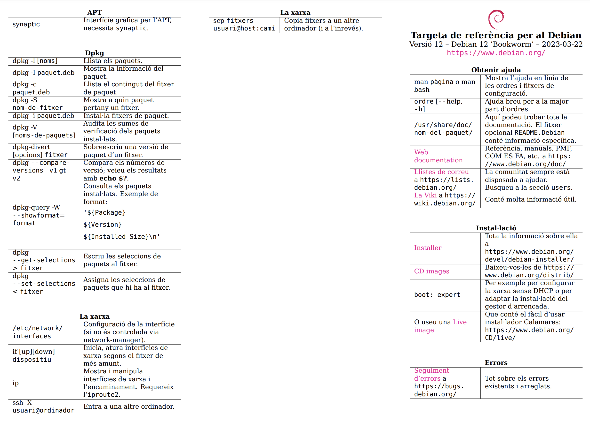

# Tour per a Debian

## Usuaris a Debian

Els IDs d'usuari (**uid**) i els ID de grup (**gid**) són valors numèrics que s'utilitzen per identificar els usuaris del sistema i atorgar-hi els permisos adequats.

La comanda ```id X``` ens permet obtenir informació sobre un usuari concret **X**. Per exemple, si executem `id jordi`, obtenim la següent informació: *uid=1000(jordi) gid=1000(jordi) grups=1000(jordi),24(cdrom),25(floppy), 29(audio),30(dip),44(video),46(plugdev),100(users),106(netdev)*.

```bash
jordi@debianlab:~$ id jordi
uid=1000(jordi) gid=1000(jordi) grups=1000(jordi),24(cdrom),25(floppy),
29(audio),30(dip),44(video),46(plugdev),100(users),106(netdev)
```

En aquest cas, podem veure que l'usuari *jordi* té un **uid** de *1000* i pertany als següents grups:

* **cdrom (gid 24)**: Aquest grup permet l'accés de lectura i escriptura als dispositius de CD/DVD. Els membres d'aquest grup tenen permisos per interactuar amb aquests tipus de dispositius.
* **floppy (gid 25)**: El grup floppy ofereix accés als dispositius de disquet. Els membres d'aquest grup poden llegir i escriure en aquests dispositius.
* **audio (gid 29)**: Aquest grup permet als seus membres utilitzar els dispositius d'àudio. Això inclou la reproducció de so i l'enregistrament d'àudio.
* **dip (gid 30)**: El grup dip proporciona accés als paràmetres de disc i xarxa. Això permet als membres configurar i ajustar la configuració de la xarxa i altres paràmetres relacionats amb el disc.
* **video (gid 44)**: Aquest grup dóna als seus membres accés als dispositius de vídeo i als controladors relacionats. És útil per als usuaris que treballen amb aplicacions que requereixen manipulació de vídeo.
* **plugdev (gid 46)**: El grup plugdev permet als seus membres gestionar dispositius connectats o desconnectats al sistema. Això inclou dispositius USB i altres dispositius connectables.
* **users (gid 100)**: Aquest grup és el grup principal dels usuaris normals del sistema. Proporciona un conjunt bàsic de permisos per a tasques comunes.
* **netdev (gid 106)**: El grup netdev ofereix accés als dispositius de xarxa. Això inclou la configuració i el control de les interfícies de xarxa.

Cada grup té un propòsit específic i atorga certes capacitats i privilegis als seus membres. És important entendre els grups als quals pertany un usuari per tal de comprendre els seus permisos i accions autoritzades al sistema Debian.


## Tipus d'usuaris 

* Usuari **root**: Aquest usuari té tots els privilegis del sistema operatiu. Pot realitzar qualsevol tipus d'operació sense restriccions; crear i eliminar usuaris, fitxers, directoris, processos i fins i tot eliminar el mateix sistema operatiu.

* Usuari **normal**: La resta d'usuaris. Aquests usuaris tenen uns permisos i rols concedits per l'usuari *root* i únicament poden gestionar els recursos que tenen assignats.

És important utilitzar l'usuari **root** amb precaució i només quan sigui absolutament necessari. En la majoria dels casos, és recomanable utilitzar els usuaris normals per a tasques diàries i reservar l'ús de l'usuari **root** només per a tasques d'administració del sistema.

La seguretat i la gestió adequada dels usuaris són factors clau per a un sistema ben configurat i protegit.

## Canvi de sessió d'usuari

Un cop iniciada la sessió amb un usuari concret, com ara *jordi*, a vegades pot ser necessari canviar a un altre usuari per a realitzar tasques específiques o per accedir a recursos restringits. A Debian, podem canviar de sessió d'usuari utilitzant la comanda ```su```.

Podem utilitzar l'ordre su seguida del nom de l'usuari al qual volem canviar per iniciar una nova sessió amb aquest usuari (`su [usuari]`). La comanda demanarà la contrasenya d'aquest usuari per a la verificació. Un cop s'hagi proporcionat la contrasenya correcta, es canviarà la sessió d'usuari i l'indicador del símbol del sistema **($ o #)** canviarà per reflectir l'usuari actual.

Per exemple, podem canviar a l'usuari *root* utilitzant la comanda `su` sense especificar cap usuari addicional. Això ens demanarà la contrasenya de l'usuari *root* i, un cop verificada, canviarem a la sessió de l'usuari *root*. Podem tornar a canviar a l'usuari original utilitzant la comanda exit.

```sh
jordi@debianlab:~$ whoami
jordi@debianlab:~$ cat /etc/master.passwd 
Permission denied
jordi@debianlab:~$ su
root@debianlab:/home/jordi# whoami
root@debianlab:/home/jordi# cat /etc/passwd
root@debianlab:/home/jordi# su jordi
jordi@debianlab:~$ whoami
jordi@debianlab:~$ exit
root@debianlab:/home/jordi# whoami
jordi@debianlab:~$ exit
jordi@debianlab:~$ exit
```

**Observació**: Si utilitzem `su - [usuari]`, aquesta opció carregarà totes les configuracions d'entorn del nou usuari, incloent variables d'entorn, directori personal i altres configuracions específiques. Això assegurarà que la nova sessió d'usuari tingui les mateixes configuracions que si s'iniciés una sessió nova.

### Pujada de privilegis (sudo)

Però, a més de la comanda `su`, hi ha una altra opció que pot ser útil per a la pujada de privilegis: el paquet `sudo`. Amb sudo, un usuari pot obtenir temporàriament privilegis d'administració per a realitzar tasques específiques sense haver de canviar completament de sessió.

Per utilitzar sudo, primer cal instal·lar el paquet mitjançant la comanda `apt install sudo`. Un cop instal·lat, els usuaris que estiguin en el *grup sudo* podran utilitzar la comanda `sudo` per a executar comandes amb privilegis d'administració. La comanda sudo demanarà la contrasenya de l'usuari actual i, si es verifica correctament, permetrà a l'usuari executar la comanda desitjada amb privilegis temporals.

## Instal·lació de paquets (apt)

Debian utilitza un sistema de gestió de paquets *APT* (Advanced Package Tool) per instal·lar, actualitzar i eliminar paquets de programari. 

Com a usuari normal, no podem utilitzar la comanda `apt` per a instal·lar, actualitzar i eliminar paquets de programari. Per tant, haurem de fer un pujada de privilegis a **root**.

```sh
jordi@debianlab:~$  su -c "apt update &&  apt upgrade -y"
```

Es bona pràctica mantenir el sistema de paquets actualitzat. Per a això, utilitzarem la comanda `apt update` per actualitzar les llistes de paquets disponibles i `apt upgrade` per actualitzar els paquets instal·lats al sistema. Es recomana executar aquestes comandes periòdicament.

Per instal·lar un nou paquet podem utilitzar la comanda `apt install [paquet]`. Per exemple, per instal·lar el paquet `tree`:

```sh
jordi@debianlab:~$ su -c "apt install tree -y"
```

El paquet `tree` permet visualitzar un directori en forma d'arbre. Per utilitzar-lo, podem executar la comanda `tree /etc/ssh` per visualitzar l'estructura de directoris del directori `/etc/ssh`:

```sh
jordi@debianlab:~$ tree /etc/ssh
/etc/ssh
├── moduli
├── ssh_config
├── ssh_config.d
├── sshd_config
├── sshd_config.d
├── ssh_host_ecdsa_key
├── ssh_host_ecdsa_key.pub
├── ssh_host_ed25519_key
├── ssh_host_ed25519_key.pub
├── ssh_host_rsa_key
└── ssh_host_rsa_key.pub
```

Per eliminar un paquet, podem utilitzar la comanda `apt remove [paquet]`. Per exemple, per eliminar el paquet `tree`:

```sh   
jordi@debianlab:~$ su -c "apt remove tree -y"
```

Si, a part volem eliminar el paquet i els fitxers de configuració associats, podem utilitzar la comanda `apt purge [paquet]`. Per exemple, per eliminar el paquet `tree` i els fitxers de configuració associats:

```sh
jordi@debianlab:~$ su -c "apt purge tree -y"
```

Finalment, apt també ens permet cerca paquets disponibles. Per exemple, per cercar paquets que continguin la paraula `vi`:

```sh
jordi@debianlab:~$ apt search neovim
S'està ordenant… Fet
Cerca a tot el text… Fet
dh-vim-addon/stable 0.4 all
  debhelper addon to help package Vim/Neovim addons

interception-caps2esc/stable 0.3.2-1+b1 amd64
  interception plugin for dual function Esc/Ctrl key at CapsLock

lua-nvim/stable 0.2.4-1-1 amd64
  Lua client for Neovim

lua-nvim-dev/stable 0.2.4-1-1 amd64
  Lua client for Neovim (development files)

neovim/stable 0.7.2-7 amd64
  heavily refactored vim fork

neovim-qt/stable 0.2.16-1 amd64
  neovim client library and GUI

neovim-runtime/stable 0.7.2-7 all
  heavily refactored vim fork (runtime files)

python3-neovim/stable 0.4.2-2 all
  transitional dummy package

python3-pynvim/stable 0.4.2-2 all
  Python3 library for scripting Neovim processes through its msgpack-rpc API

ruby-neovim/stable 0.8.1-1 all
  Ruby client for Neovim

vim-ale/stable 3.3.0-1 all
  Asynchronous Lint Engine for Vim 8 and NeoVim

vim-redact-pass/stable 1.7.4-6 all
  stop pass(1) passwords ending up in Vim cache files
```

Observem que podem instal·lar el paquet `neovim` per utilitzar-lo com a editor de text en la versio *0.7.2-7*. Neovim és un editor de text que es basa en el projecte Vim. Neovim té com a objectiu millorar Vim, mantenint la compatibilitat amb els scripts i plugins de Vim. Per instal·lar el paquet `neovim`:

```sh
jordi@debianlab:~$ su -c "apt install neovim -y"
```

## Què són les variables d'entorn?

Les variables d'entorn són una part important del sistema operatiu que permet als processos interactuar amb el seu entorn. Una variable d'entorn és bàsicament una etiqueta que conté un valor. Aquests valors poden ser utilitzats pels processos per accedir a informació específica o configurar el seu comportament.

Les variables d'entorn són àmplies i poden contenir tot tipus d'informació, com ara la ruta d'accés als executables (*PATH*), la llengua preferida (*LANG*), el directori personal de l'usuari (*HOME*), entre altres. Aquestes variables poden ser útils per als processos per a personalitzar el seu comportament i accedir a recursos específics en funció del seu entorn.

Algunes de les més habituals són:

* **PATH**: Informació sobre les rutes per cercar ordres/comandes externes. 
* **HOME**: Aquesta variable emmagatzema la ruta del directori inicial de l'usuari actual. És útil per a referir-se al directori personal d'un usuari en scripts o comandes. Podem utilitzar `echo $HOME`` per visualitzar la ruta del directori inicial de l'usuari actual. És equivalent a **~**. 
* **USER**: Usuari actual. 
* **PWD**: Directori actual. 
* **MAIL**: Fitxer on s'emmagatzema el correu.

Per exemple, podem utilitzar la comanda `printenv` per veure l'entorn d'una sessió. Quan s'inicia una sessió amb un usuari, les variables d'entorn associades a aquest usuari estan disponibles per a tots els processos en aquesta sessió. Si canviem de sessió d'usuari utilitzant su, les variables d'entorn també canviaran per reflectir l'usuari actual.

```sh
jordi@debianlab:~$ whoami
jordi@debianlab:~$ printenv
jordi@debianlab:~$ su 
root@debianlab:/home/jordi# whoami
root@debianlab:/home/jordi# printenv
root@debianlab:/home/jordi# exit
jordi@debianlab:~$ su -
root@debianlab:/home/jordi# whoami
root@debianlab:/home/jordi# printenv
```

## Com puc gestionar les variables d'entorn?

Les principals operations que podem realitzar sobre les variables d'entorn són:

* ```set```: Permet inicialitzar la variable en la sessió (*shell*) actual.
* ```export```:  Permet inicialitzar la variable en la sessió actual i totes les sessions que es creïn a partir d'aquesta (**herència**).
* ```unset```: Permet eliminar una variable d'entorn.

```sh
jordi@debianlab:~$ echo $HOME
jordi@debianlab:~$ unset HOME
jordi@debianlab:~$ cd $HOME
jordi@debianlab:~$ export HOME=/home/jordi
jordi@debianlab:~$ cd $HOME
jordi@debianlab:~$ pwd
```

La variable **PATH** conté una llista de rutes on el sistema buscarà ordres o comandes externes quan s'intenti executar un programa. Per exemple, si volem executar un programa com `ls`, el sistema cercarà en les rutes especificades a la variable *PATH* per trobar l'executable `ls`. Si l'executable es troba en una d'aquestes rutes, el programa es podrà executar sense problemes.

Podem comprobar amb `whereis ls` que la ruta on es troba la utilitat `ls`, esta inclosa al *PATH*.

```sh
jordi@debianlab:~$ echo $PATH
/usr/local/bin:/usr/bin:/bin:/usr/local/games:/usr/games
jordi@debianlab:~$ whereis ls
ls: /usr/bin/ls /usr/share/man/man1/ls.1.gz
```

Per modificar temporalment el *PATH*, podem assignar-li un nou valor. Per exemple, podem eliminar el contingut de la variable *PATH* amb **PATH=**. En aquest cas, si intentem executar una comanda com ls, el sistema no la trobarà ja que no està especificada en cap de les rutes del *PATH*.

```sh
jordi@debianlab:~$ PATH=
jordi@debianlab:~$ ls
-bash: ls: El fitxer o directori no existeix
jordi@debianlab:~$ /usr/bin/ls
a.txt
```

Per tornar a l'estat inicial:
```sh
jordi@debianlab:~$ PATH="/usr/local/bin:/usr/bin:/bin:/usr/local/games:/usr/games"
```

## Què són les shells?

Fins ara hem estat enviant ordres al sistema operatiu de forma directa (`whoami`, `printenv`, `su`...). 

La **Shell** ens permet executar ordres utilitzant el nucli del sistema operatiu i ocultant-lo de l'usuari que executa l'ordre. 

| Shell             | Descripció                                                                                                         |
|-------------------|-------------------------------------------------------------------------------------------------------------------|
| Bourne shell      | És la original d'Unix i sol ser la predeterminada en moltes distribucions Linux.                                 |
| C shell           | Sintaxi similar a C amb funcionalitat avançada com: finalització de comandes amb Tab, històric,...              |
| Korn Shell        | Combina les dues anteriors.                                                                                        |
| Bash              | Compatible amb la Bourne shell però amb extensions i funcions avançades.                                           |
| Z shell           | Similar a la Bash però amb més opcions de personalització i una experiència d'ús millorada.                       |

A través de la història de Linux i Unix, molts programadors han desenvolupat shells segons les seves preferències personals. 

## Cat \& Echo

La comanda ```cat``` llegeix les dades de l'arxiu i mostra el seu contingut com a sortida (**stdout**). Permet crear, veure i concatenar fitxers. La comanda `echo` s'utilitza per mostrar text com a sortida (**stdout**). És similar a la funció `printf` en C i mostra el seu contingut com a sortida.

Podeu utilitar la comanda ```cat``` per mostrar el contingut del fitxer */etc/shells*  que us mostrarà totes les *shells* disponible al vostre sistema i la comanda ```echo``` per mostrar el contingut ([**$**]{.alert}) de la variable d'entorn **SHELL** que us indicarà quina teniu activa en la vostra sessió de treball actual. 

```sh
jordi@debianlab:~$ cat /etc/shells
jordi@debianlab:~$ echo $SHELL
```


## Sintaxi de les comandes

``` $ comanda [opcions] [arguments] ```

* **comanda**: nom de la comanda.
* **opcions**: flags i opcions.
* **arguments**: objectes que la comanda necessita (e.g. *fitxers*).
* En una línia podem escriure múltiples comandes separades per **;**.
* Una comanda la podem continuar a la línia següent amb **[\\\\]**.

```sh
jordi@debianlab:~$ cat /etc/shells
jordi@debianlab:~$ cat -e /etc/shells
jordi@debianlab:~$ whoami; cat /etc/shells
```


## Què és el Manual?

El manual ```man``` ens dona informació sobre la sintaxi de les comandes, el seu funcionament, opcions, arguments i exemples d'ús.

- Pots desplaçar-te pel manual utilitzant les fletxes de navegació (amunt i avall) o prement la tecla Enter.
- Per sortir del manual, pots simplement premer la tecla 'q'.
- Si vols cercar una paraula clau dins del manual, pots utilitzar la tecla '\\' seguida del text que vols cercar. Pots desplaçar-te pels resultats de cerca prement *Enter*.

A través de la comanda `man cat`, pots veure com el manual proporciona una explicació detallada de la comanda `cat`, la seva sintaxi, opcions, arguments i exemples d'ús

## Com esta organitzat el Manual?

El manual està organitzat en seccions temàtiques, cadascuna centrada en un tema específic:

  - **Secció 1**: Comandes executables o programes de l'usuari (e.g., `cat`, `ls`).
  - **Secció 2**: Crides de sistema (system calls) i funcions del nucli del sistema operatiu.
  - **Secció 3**: Funcions de biblioteca de programació.
  - **Secció 4**: Arxius especials del sistema i dispositius (e.g., `/dev/null`, `/dev/sda`).
  - **Secció 5**: Arxius de configuració del sistema (e.g., `/etc/passwd`, `/etc/fstab`).
  - **Secció 6**: Jocs (e.g., `nethack`, `snake`).
  - **Secció 7**: Diversos documents, com ara convencions de fitxers i protocols de xarxa.
  - **Secció 8**: Ordres per a administradors de sistema (e.g., `mount`, `ifconfig`).

Com en aquest curs ens centrarem en desenvolupar aplicacions per a usuaris utilitzant la biblioteca estàndard de C, instal·larem el paquet `manpages-dev` per a tenir accés a la secció 3 del manual.

```sh
jordi@debianlab:~$ su -c "apt install manpages-dev -y"
```

## Temps i Dates a Debian 

- `date`: Mostra la data i hora actual.
- `uptime`: Mostra el temps transcorregut des de l'últim reinici.
- `time`: Mesura el temps d'execució d'una comanda i en dóna informació detallada.

En el següent exemple, es mostra com es poden utilitzar aquestes comandes i el tipus d'informació que proporcionen:

```sh
jordi@debianlab:~$ date
     dijous, 20 de juliol de 2023, 10:26:05 CEST
jordi@debianlab:~$ uptime
     10:26:36 up 59 min,  1 user,  load average: 0,00, 0,01, 0,00
jordi@debianlab:~$ time ls
     shell  3,49s user 2,55s system 0% cpu 58:34,01 total
     children  54,04s user 17,78s system 2% cpu 58:34,01 total
```

En molts sistemes, el tipus de dades `time_t` s'utilitza per representar valors de temps. Aquest tipus de dades emmagatzema el temps com un nombre enter, que sol ser un nombre de segons des de l'1 de gener de 1970. **time_t** emmagatzema el temps com un nombre enter signat de 32 bits. 

Per tant, únicament pot representar enters entre [−(231) i 231 −1], \blueArrow l'última hora que es pot codificar correctament és **231 − 1** segons després de l'època UNIX *(03:14:07 UTC el 19 de gener de 2038)*. Intentar augmentar al segon següent *(03:14:08)* **farà que l'enter es desbord**i, establint el seu valor a **-(231)**, que els sistemes interpretaran com a [231 segons abans de l'època]{.alert} *(20:45:52 UTC el 13 de desembre de 1901)*. Podeu consultar la següent font per a informació detallada sobre el problema [https://en.wikipedia.org/wiki/Year_2038_problem](https://en.wikipedia.org/wiki/Year_2038_problem)

Els desenvolupadors de Debian han tingut en compte aquest problema i han pres les mesures adequades per a evitar-ne les conseqüències negatives. Això proporciona als usuaris de Debian la confiança de poder utilitzar el sistema de forma fiable i precisa en la gestió de temps, sense preocupar-se pel problema del 2038.

En el següent exemple es pot observar com debian es capaç de representar una data superior al 2038. Això és deu a que **time_t** utilitza un nombre amb 64 bits.

```sh
jordi@debianlab:~$ date -d "1 Jan 2040"
Thu Jan  1 00:00:00 UTC 2040
```

## Sistema de fitxers

El sistema de fitxers és l'estructura que utilitza un sistema operatiu per *organitzar i emmagatzemar informació en el disc*. Aquest sistema defineix com es guarden i s'accedeixen als fitxers i directoris en el sistema operatiu.

- **Fitxers**: Un fitxer és una col·lecció d'informació que es guarda en el disc. Pot contenir text, dades binàries, codi executable, entre altres tipus d'informació.
- **Directoris**: Els directoris són utilitzats per organitzar els fitxers en grups lògics. Cada fitxer es troba en un directori específic, i els directoris poden contenir altres directoris o fitxers.
- **Fitxers especials**: A més dels fitxers i directoris regulars, hi ha altres tipus de fitxers especials que representen dispositius connectats al sistema. Poden ser de caràcters o de blocs, depenent del tipus de dispositiu.

La comanda ```lsblk``` ens permet veure una llista de tots els dispositius de blocs del sistema, com ara discos i particions. Aquesta comanda ens mostra el nom del dispositiu, la seva mida, el tipus de dispositiu i el punt de muntatge associat. 

```bash
jordi@debianlab:~$ lsblk
NAME   MAJ:MIN RM  SIZE RO TYPE MOUNTPOINTS
sda      8:0    0   20G  0 disk
├─sda1   8:1    0  512M  0 part /boot/efi
├─sda2   8:2    0 18,5G  0 part /
└─sda3   8:3    0  976M  0 part [SWAP]
sr0     11:0    1 1024M  0 rom
```

En el meu cas, es pot observar un disc (**sda**) amb 3 particions (**sda1,sda2,sda3**) i un dispositiu rom (**sr0**). Aquest dispositiu rom és un dispositiu de lectura de CD/DVD.

Cada *disc o partició* té el seu propi sistema de fitxers. Pots utilitzar la comanda `df -h` per veure una llista de les particions i els seus sistemes de fitxers associats, així com la informació d'ús d'espai en disc.

```bash
jordi@debianlab:~$ df -h
S. fitxers      Mida En ús Lliure  %Ús Muntat a
udev            1,9G     0   1,9G   0% /dev
tmpfs           392M  616K   391M   1% /run
/dev/sda2        19G  1,7G    16G  10% /
tmpfs           2,0G     0   2,0G   0% /dev/shm
tmpfs           5,0M     0   5,0M   0% /run/lock
/dev/sda1       511M  5,9M   506M   2% /boot/efi
tmpfs           392M     0   392M   0% /run/user/1000
```

En aquest exemple, podem veure que hi ha dues particions amb sistemes de fitxers associats:

* **/dev/sda2**: Partició del disc que té un sistema de fitxers associat i està muntat com a directori arrel **(/)**. Té una mida total de 19G, amb 1,7G utilitzats i 16G lliures. El % d'ús és del 10%. *Aquesta partició conté el sistema operatiu Debian*.

* **/dev/sda1**: Partició del disc que té un sistema de fitxers associat i està muntat a **/boot/efi**. Té una mida total de 511M, amb 5,9M utilitzats i 506M lliures. El % d'ús és del 2%. *Aquesta partició conté els arxius d'arrencada del sistema operatiu Debian*. Els sistemes [UEFI] requereixen una partició especial per a emmagatzemar arxius d'arrencada. 

Podem observar diferents sistemes de fitxers com *udev*, *tmpfs*. Aquestes particions són particions virtuals que no tenen un dispositiu físic associat. Aquestes particions virtuals tenen assignades un espai de memòria i són utilitzades pel sistema operatiu per a emmagatzemar informació temporal. 

Anem a veure com esta organitzat el sistema de fitxers de Debian. A través del sistema de fitxers principal, els usuaris poden gestionar i accedir a la informació emmagatzemada en el disc. És important comprendre l'estructura i el funcionament del sistema de fitxers per a una correcta gestió i organització dels fitxers i directoris en el sistema operatiu Debian.

```sh
jordi@debianlab:~$ tree -L 1 -d 
├── bin -> usr/bin
├── boot
├── dev
├── etc
├── home
├── lib -> usr/lib
├── lib32 -> usr/lib32
├── lib64 -> usr/lib64
├── libx32 -> usr/libx32
├── lost+found
├── media
├── mnt
├── opt
├── proc
├── root
├── run
├── sbin -> usr/sbin
├── srv
├── sys
├── tmp
├── usr
└── var
```

| Directori | Contingut                               |
|-----------|-----------------------------------------|
| bin       | Binaris d'ordres essencials              |
| boot      | Fitxers estàtics del carregador de l'arrencada |
| dev       | Fitxers de dispositius                   |
| etc       | Configuració específica de l'amfitrió del sistema |
| home      | Directoris d'inici d'usuari              |
| lib       | Llibreries compartides essencials i mòduls del nucli |
| media     | Punts de muntatge per a mitjans reemplaçables |
| mnt       | Punt de muntatge per muntar un sistema de fitxers temporalment |
| opt       | Paquets de programari addicional         |
| proc      | Directori virtual per a informació del sistema |
| root      | Directori d'inici per a l'usuari root    |
| run       | Dades variables d'execució               |
| sbin      | Binaris essencials del sistema           |
| srv       | Dades per a serveis proporcionats pel sistema |
| sys       | Directori virtual per a informació del sistema |
| tmp       | Fitxers temporals                        |
| usr       | Jerarquia secundària                     |
| var       | Dades variables                          |
| .         | Directori actual                        |
| ..        | Directori anterior                      |


## Inodes

Els **inodes** són una estructura de metadades utilitzada pels sistemes de fitxers per emmagatzemar informació sobre els fitxers i directoris. Cada fitxer o directori en un sistema de fitxers té un inode associat.

](../HandsOn-00/figs/inodes.png)

En la figura extreta de [devconnected.com](https://devconnected.com/wp-content/uploads/2019/08/storage-first-layer.png) es pot observar com els inodes guarden tota la informació necessaria per a cercar el bloc de dades associat a un fitxer o directori en el disc físic. 

Les principals característiques dels inodes són:

- **Identificador Únic**: Cada inode té un identificador únic que l'identifica de manera única dins del sistema de fitxers.
- **Metadades del Fitxer**: L'estructura d'un inode emmagatzema metadades importants com el tipus de fitxer, els permisos d'accés, el propietari i el grup, el tamany del fitxer i les timestamps de creació, modificació i accés.
- **Apuntadors a Blocs**: Els inodes contenen apuntadors a blocs de dades que emmagatzemen el contingut real del fitxer.
- **Enllaços Durs i Soft**: El nombre d'enllaços durs i enllaços simbòlics que apunten a un inode determina la seva referència i disponibilitat.

Podem utilitzar la comanda `stat` per veure les metadades d'un fitxer o directori. En aquest exemple, podem veure les metadades del directori */home*.

```bash
jordi@debianlab:~$: stat /home/
     Fitxer: /home/
       Mida: 4096      	Blocs: 8          Bloc d’E/S: 4096   directori
Device: 8,2	Inode: 913921      Links: 3
      Accés: (0755/drwxr-xr-x)  UID: (    0/    root)   GID: (    0/    root)
      Accés: 2023-07-11 09:52:31.307443950 +0200
Modificació: 2023-07-07 16:54:09.656731220 +0200
      Canvi: 2023-07-07 16:54:09.656731220 +0200
  Naixement: 2023-07-07 16:34:47.016777227 +0200
```

Els inodes són una part fonamental del sistema de fitxers i proporcionen informació essencial per a l'organització i accés als fitxers i directoris en el sistema operatiu.


## Enllaços

Com heu pogut observar al resultat de la comanda `stat`, el directori */home* té 3 enllaços. Els enllaços són una estructura que permet als fitxers i directoris tenir múltiples noms de ruta. També, heu observat que la sortida de la comanda tree mostra **->** en alguns directoris. Això indica que aquests directoris són enllaços simbòlics. O bé, la comanda **ls -l** també ens mostra la **->** indicant que és un enllaç simbòlic. *Però que són exactament els enllaços?*

Els enllaços són una característica important del sistema de fitxers que permeten als fitxers i directoris tenir múltiples noms de ruta, proporcionant una forma eficient i versàtil d'organitzar i accedir als recursos del sistema. Aquests enllaços poden ser de dos tipus:

* **Enllaç dur**: Un enllaç dur és una entrada de directori que apunta directament a un inode, el qual representa un fitxer o directori. D'aquesta manera, diversos enllaços durs poden apuntar al mateix inode, compartint el mateix contingut. Quan esborrem un enllaç dur, el fitxer es manté en el sistema fins que tots els enllaços durs que apunten a l'inode són eliminats. Els enllaços durs són útils per a situacions on volem mantenir múltiples referències al mateix fitxer sense duplicar-lo físicament. Aquesta característica permet estalviar espai d'emmagatzematge i assegura que els canvis fets a un enllaç dur es reflecteixin a tots els altres enllaços que apunten al mateix inode.

* **Enllaç simbòlic**: Un enllaç simbòlic és una entrada de directori especial que apunta a una ruta de directori o fitxer a través d'un altre inode. A diferència dels enllaços durs, un enllaç simbòlic és simplement un punter a la ruta de destinació, en lloc de compartir el mateix inode amb el fitxer o directori original. Si esborrem un enllaç simbòlic, això no afectarà la ruta de destinació. Els enllaços simbòlics són útils quan volem fer referència a un fitxer o directori en una ubicació diferent o amb un nom més amigable, sense moure físicament el fitxer o alterar la seva ubicació original. Això és particularment útil en situacions en què necessitem accedir a fitxers o directoris des de diversos punts del sistema sense duplicar-los.

](../HandsOn-00/figs/hard-soft.png)


En la figura extreta de [lpic1-exam-guide](https://borosan.gitbook.io/lpic1-exam-guide/1046-create-and-change-hard-and-symbolic-links) es pot observar com els enllaços durs i simbòlics són diferents. Els enllaços durs són una referència directa a un inode. Això significa que els enllaços durs i el fitxer original tenen el mateix inode. Els enllaços durs comparteixen el mateix inode i, per tant, comparteixen el mateix contingut. En canvi, els enllaços simbòlics són una referència indirecta a un inode. Això significa que els enllaços simbòlics i el fitxer original tenen diferents inodes. D'aquesta manera, atorguen més flexibilitat i versatilitat en la gestió dels fitxers i directoris.

Per a crear enllaços durs i simbòlics, utilitzarem la comanda `ln`. Aquesta comanda té dos tipus d'ús:

* ```ln f1 f2``` s'utilitza per crear un nou enllaç dur que tingui el nom de ruta f2 per a un fitxer identificat amb el nom de ruta f1.

* ```ln -s f1 f2``` crea un nou enllaç **soft** amb **f2** que fa referència a **f1**.  El sistema de fitxers extreu la part del directori de **f2** i crea una nova entrada en aquest directori de tipus enllaç simbòlic, amb el nom indicat per **f2**. Aquest nou fitxer conté el nom indicat pel nom de ruta **f1**. Cada referència a **f2** es pot traduir automàticament en una referència a **f1**.

Considerem el següent escenari: tens dos fitxers, `fitxer1.txt` i `fitxer2.txt`, al teu directori actual.

```bash
jordi@debianlab:~$ echo "Contingut del fitxer 1" > fitxer1.txt
jordi@debianlab:~$ echo "Contingut del fitxer 2" > fitxer2.txt
jordi@debianlab:~$ ls -i fitxer1.txt fitxer2.txt
jordi@debianlab:~$ ln fitxer2.txt enllac_hard.txt
jordi@debianlab:~$ ln -s fitxer1.txt enllac_soft.txt
jordi@debianlab:~$ ls -i enllac_hard.txt enllac_soft.txt
```

En aquest exemple es mostra la creación de dos fitxers, la visualización dels seus inodes y la creació dels dos tipus d'enllaços. Podem observar com els enllaços durs tenen el mateix inode que el fitxer original, mentre que els enllaços simbòlics tenen un inode diferent. 

## Estrucutra de fitxers i directoris

En els exemples realitzat fins ara heu observat com el sistema de fitxers està organitzat en forma d'arbre. Aquest arbre té un node arrel, que és el directori arrel **/**. Aquest directori arrel conté tots els fitxers i directoris del sistema. Aquests fitxers i directoris poden contenir altres fitxers i directoris, i així successivament. Aquesta estructura d'arbre és la que permet organitzar i accedir als fitxers i directoris en el sistema operatiu. L'estructura **arbre** d'Unix/Linux requereix que per accedir a un *fitxer* o *directori* necessitem especificar la seva **ruta**.

* Ruta absoluta: Especifiquem tot el camí des del directori **arrel**. 
* Ruta relativa: Especifiquem  tot el camí des del directori **actual**.

Imagineu que estem al directori de l'usuari **/home/jordi** i volem imprimir amb ```cat``` el fitxer *a.txt*. Tenim dues opcions:
* Ruta absoluta: ```cat /home/jordi/a.txt```
* Ruta relativa: ```cat a.txt```

Per navegar per l'arbre de directoris, utilitzarem la comanda `cd`. Aquesta comanda ens permet canviar el directori actual. Si no especifiquem cap ruta, la comanda `cd` ens portarà al directori arrel **/**. Hi ha dos rutes especials que podem utilitzar per a navegar per l'arbre de directoris: **.** i **..**. El directori **.** representa el directori actual, mentre que el directori **..** representa el directori pare. 

Anem a estudiar un cas d'ús simple per exemplificar-ho:

1. Primer ens situarem al directori */home/jordi*. *Recordeu modificar jordi pel vostre nom d'usuari*.
2. Crearem un fitxer amb la comanda ```echo```. Redirigim la sortida de la cadena *Hola Jordi* al fitxer **a.txt** amb la redirecció [>]. La redirecció permet enviar la sortida d'una comanda a un fitxer. Més endavant al curs veurem i entendrem com funciona.
3. Imprimim el contingut del fitxer a la sortida estàndard (**stdout**) amb ruta absoluta i relativa.
4. Ens situem al directori anterior.
5. Observem com la ruta absoluta continua funcionant, però no la relativa.

```sh
jordi@debianlab:~$ cd /home/jordi
jordi@debianlab:~$ echo "Hola Jordi" > a.txt
jordi@debianlab:~$ cat /home/jordi/a.txt
jordi@debianlab:~$ cat a.txt
jordi@debianlab:~$ cd ..
jordi@debianlab:~$ cat /home/jordi/a.txt
jordi@debianlab:~$ cat a.txt
```

## Sistema de protecció de fitxers

Els sistemes **UNIX/Linux** permet controlar **QUI** pot accedir als fitxers i directoris a través dels permisos. Hi ha tres tipus de permisos: **lectura**, **escriptura** i **execució**. Aquests permisos es poden assignar a tres tipus d'usuaris: **owner**, **group** i **others**.

* **Owner**: Usuari que ha creat el fitxer.
* **Group**: Usuaris dels grups.
* **Other**: Qualsevol usuari del sistema.

* **Lectura [r]**: Dona accés al contingut del fitxer o a llistar fitxers dins del directori
* **Escriptura [w]**: Permet canviar el contingut del fitxer o crear/suprimir fitxers 
* **Execució [x]**: Permet executar el fitxer/ordre o permet cercar un directori


L'usuari *jordi* és owner del fitxer **a.txt** i pot **llegir/escriure** però no **executar**. Els membres del grup *jordi* poden **llegir** el fitxer, però **no escriure ni executar**. Igual que la resta d'usuaris.

```bash
jordi@debianlab:~$ touch a.txt
jordi@debianlab:~$ ls -la a.txt
-rw-r--r-- 1 jordi jordi 0 11 de jul.  11:26 a.txt
```

Per a gestionar els permisos dels fitxers i directoris, utilitzarem la comanda `chmod`. Aquesta comanda ens permet canviar els permisos d'accés dels fitxers i directoris. La sintaxi de la comanda és la següent:

```chmod [qui] operació permisos fitxer```

En el següent exemple, realitzem diverses operacions amb els permisos del fitxer creat anteriorment *a.txt*.

1. Amb `ls -la a.txt`, mostrem els permisos originals del fitxer: *-rw-r--r--*.
2. Amb `chmod +x a.txt`, afegim el permís d'execució per a tots els usuaris (owner, grup i altres).
3. Amb `ls -la a.txt`, podem veure que ara el fitxer té permisos d'execució: *-rwxr-xr-x*.
4. Amb `chmod -x a.txt`, eliminem el permís d'execució per a tots els usuaris.
5. Amb `ls -la a.txt`, podem veure que els permisos d'execució han estat eliminats: *-rw-r--r--*.
6. Amb `chmod o-r a.txt`, eliminem el permís de lectura per a altres usuaris.
7. Amb `ls -la a.txt`, podem veure que ara el fitxer té permisos de lectura només per a l'usuari i el grup, i no per a altres: *-rw-r-----*.
8. Amb `chmod g+w a.txt`, afegim el permís d'escriptura per al grup.
9. Amb `ls -la a.txt`, podem veure que ara el fitxer té permisos de lectura i escriptura per a l'usuari i el grup, però no per a altres: *-rw-rw----*.
10. Finalment, amb `chmod o+w a.txt`, afegim el permís d'escriptura per a altres usuaris.
11. Amb `ls -la a.txt`, podem veure que ara el fitxer té permisos de lectura, escriptura i escriptura per a l'usuari, el grup i altres: *-rw-rw--w-*.
12. Amb la comanda `chmod a-w a.txt`, eliminem el permís d'escriptura per a tots els usuaris (owner, grup i altres). 
13. Amb `ls -la a.txt`, podem veure que el permís d'escriptura (w) ha estat eliminat per a tots els usuaris.
14. Quan intentem afegir contingut a *a.txt* amb `echo "a" >> a.txt`, obtenim un error que indica que **s'ha denegat el permís d'escriptura**.
15. Amb la comanda `chmod +w a.txt`, afegim el permís d'escriptura a tots els usuaris. 
16. Ara podem afegir contingut amb `echo "a" >> a.txt` i veure el contingut amb `cat a.txt`.
17. Finalment, amb `chmod -r a.txt`, eliminem tots els permisos de lectura per a tots els usuaris. Quan intentem llegir el contingut de *a.txt* amb `cat a.txt`, obtenim un error que indica que **s'ha denegat el permís de lectura**.

```bash
jordi@debianlab:~$ chmod +x a.txt
jordi@debianlab:~$ ls -la a.txt
-rwxr-xr-x 1 jordi jordi 0 11 de jul.  11:26 a.txt
jordi@debianlab:~$ chmod -x a.txt
jordi@debianlab:~$ ls -la a.txt
-rw-r--r-- 1 jordi jordi 0 11 de jul.  11:26 a.txt
jordi@debianlab:~$ chmod o-r a.txt
jordi@debianlab:~$ ls -la a.txt
-rw-r----- 1 jordi jordi 0 11 de jul.  11:26 a.txt
jordi@debianlab:~$ chmod g+w a.txt
jordi@debianlab:~$ ls -la a.txt
-rw-rw---- 1 jordi jordi 0 11 de jul.  11:26 a.txt
jordi@debianlab:~$ chmod o+w a.txt
jordi@debianlab:~$ ls -la a.txt
-rw-rw--w- 1 jordi jordi 0 11 de jul.  11:26 a.txt
jordi@debianlab:~$ chmod a-w a.txt
jordi@debianlab:~$ ls -la a.txt
-r--r----- 1 jordi jordi 0 11 de jul.  11:26 a.txt
jordi@debianlab:~$ echo "a" >> a.txt
-bash: a.txt: S’ha denegat el permís
jordi@debianlab:~$ cat a.txt
jordi@debianlab:~$ chmod +w a.txt
jordi@debianlab:~$ echo "a" >> a.txt
jordi@debianlab:~$ cat a.txt
a
jordi@debianlab:~$ chmod -r a.txt
jordi@debianlab:~$ cat a.txt
cat: a.txt: S’ha denegat el permís
```


Cheat Sheet
===========

Us podeu descàrregar i consultar la targeta de referència per a Debian 12.0 *Bookworm* en format PDF en el següent enllaç: [https://www.debian.org/doc/manuals/refcard/refcard](https://www.debian.org/doc/manuals/refcard/refcard)




Resum de comandes per a fitxers:

* ```ls -la```: Llista amb format de tots els fitxers (normals i ocults).
* ```cd```: Navegar a un directori. 
* ```pwd```: Mostra el directori actual.
* ```mkdir```: Crear un directori.
* ```rm -rf```: Eliminar de forma recursiva (fitxers i directoris).
* ```cp f1 f2```: Copia el fitxer f1 al fitxer f2.
* ```mv f1 f2```: Moure o reanomenar el fitxer f1 a f2.
* ```more f1```: Mostra el contingut del fitxer f1.
* ```less f1```: Mostra el contingut del fitxer f1.
* ```head f1```: Mostra les primeres 10 línies del fitxer f1.
* ```tail f1```: Mostra les últimes 10 línies del fitxer f1.

Resum de comandes per a consultar informació del sistema:

* ```date```: Mostra la data i el temps actuals.
* ```cal```: Mostra el calendari.
* ```uptime```: Mostra el temps que el servidor porta actiu.
* ```w```: Mostra quins usuaris estan actius online.
* ```whoami```: Mostra el nom de l'usuari actual.
* ```finger user```: Mostra informació de l'usuari.
* ```uname -a```: Mostra informació sobre el kernel.
* ```cat /proc/cpuinfo```: Mostra informació sobre la cpu.
* ```cat /proc/meminfo```: Mostra informació sobre la memòria.
* ```df```: Mostra informació sobre l'utiltizació del disc.
* ```du```: Mostra informació sobre l'espai utilitzat al directori.
* ```whereis app```: Mostra les localitzacions de app.
* ```which app```: Mostra quina app s'executarà per defecte.

Resum de comandes per a la compressió de fitxers:

* ```tar cf f.tar files```: Comprimeix files en un fitxer f.tar.
* ```tar xf file.tar```: Extreu els fitxers de file.tar al directori actual.
* ```tar czf file.tar.gz files```: Comprimeix amb Gzip.
* ```tar xzf file.tar.gz```: Extreu els fitxers comprimits amb Gzip.
* ```tar cjf file.tar.bz2 files```: Comprimeix amb Bzip2.
* ```tar xjf file.tar.bz2```: Extreu els fitxers comprimits amb Bzip2.
* ```gzip file```: Comprimeix el fitxer file i l'anomena file.gz.
* ```gzip -d file.gz```: Descomprimeix el fitxer file.gz.

Resum de comandes per consultar informació de la xarxa:

* ```ping``` host: Ping a una ip i mostra els resultats.
* ```whois``` domain: Aconsegueix informació sobre el domini.
* ```dig``` domain: Obté informació sobre els dns del domini.
* ```wget``` file: Descarrega un fitxer.