# Instal·lació del Sistema Operatiu

1. Seleccioneu l'opció **Install**:
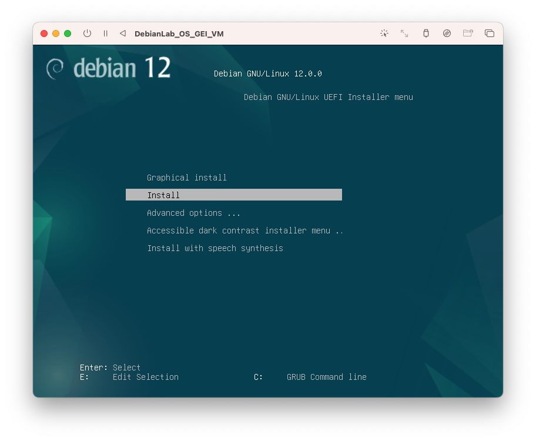

2. Configureu l'idioma, seleccioneu l'opció **Catalan**:

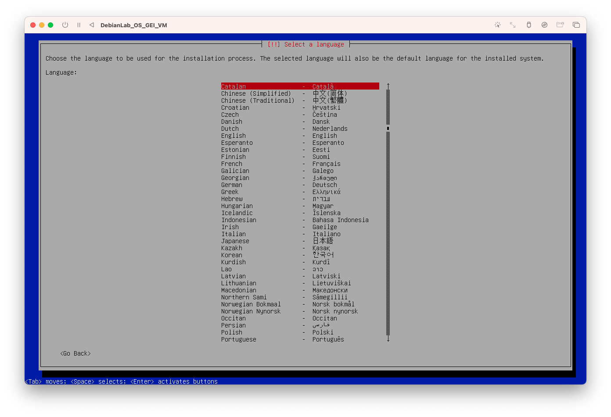

3. Configureu l'ubicació, seleccioneu l'opció **Espanya**:


4. Configureu el teclat, seleccioneu l'opció **Català**:


5. Configureu la xarxa, introduïu el nom *debianlab*:


6. Configureu la xarxa, introduïu el nom *debianlab.org*:


7. Configureu l'usuari **root**: Poseu un password de root el que vulgueu. Pot ser 1234 com a bons administradors de sistemes ^^. Introduiu el *password* i torneu a introduir la mateixa a la pantalla següent.


8. Configureu el vostre usuari, introduïu el vostre nom, en el meu cas *Jordi Mateo Fornés*:


9. Introdueix el vostre nom d'usuari, en el meu cas *jordi*:

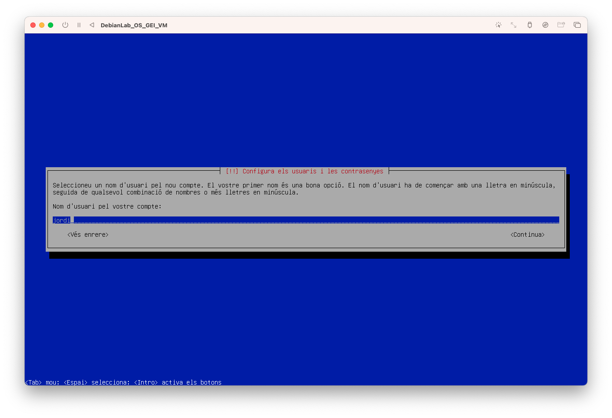

10. Introdueix el *password* del vostre usuari, en el meu cas *1234*:

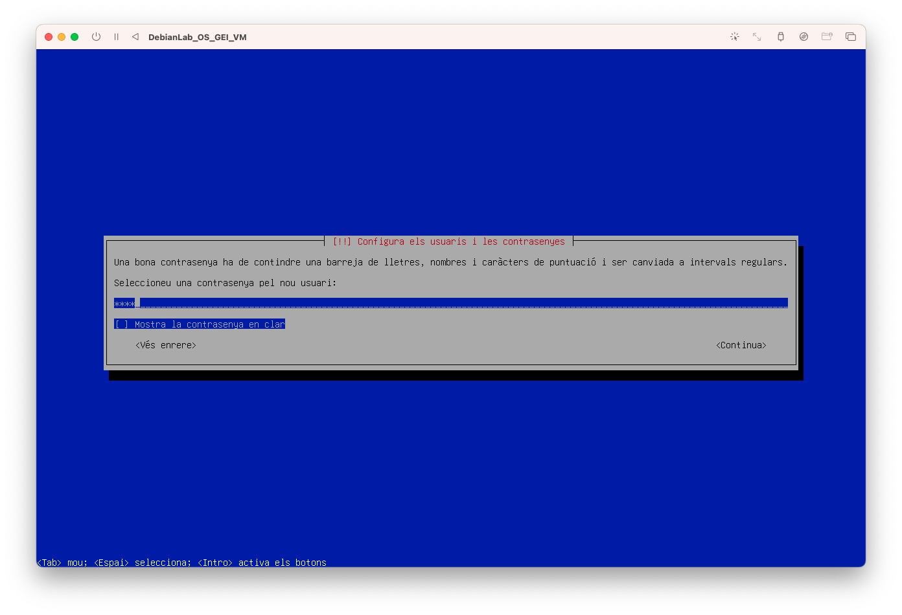


11. Configureu el fus horari i seleccioneu *Madrid*:


12. Configureu el disc utilitzant l'opció guiada i disc sencer:


13. Seleccioneu el disc on instal·lar el sistema operatiu:

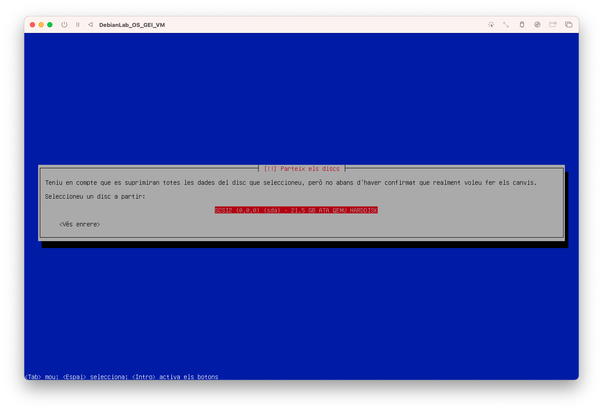

14. Seleccioneu l'opció de *Tots els fitxers en una partició*:


15. Seleccioneu *Finalitza i escriu els canvis al disc*:


16. Seleccioneu que **Si** voleu escriure els canvis al disc:

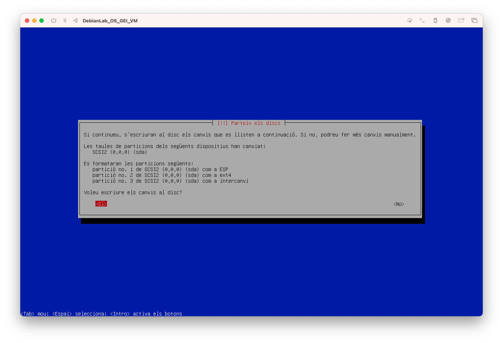

17. Configureu del gestor de paquets i seleccioneu *No*:

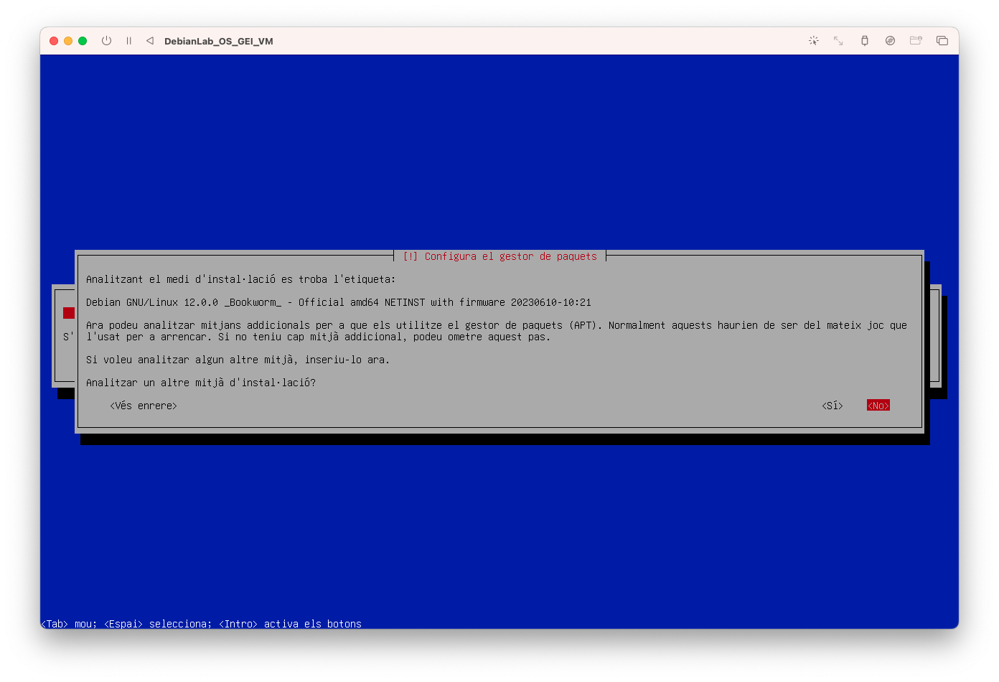

18. Configureu del gestor de paquets i seleccioneu *Espanya*:


19. Configureu el gestor de paquets i introduïu *deb.debian.org*:


20. Configureu del gestor de paquets i seleccioneu *Continuar*:

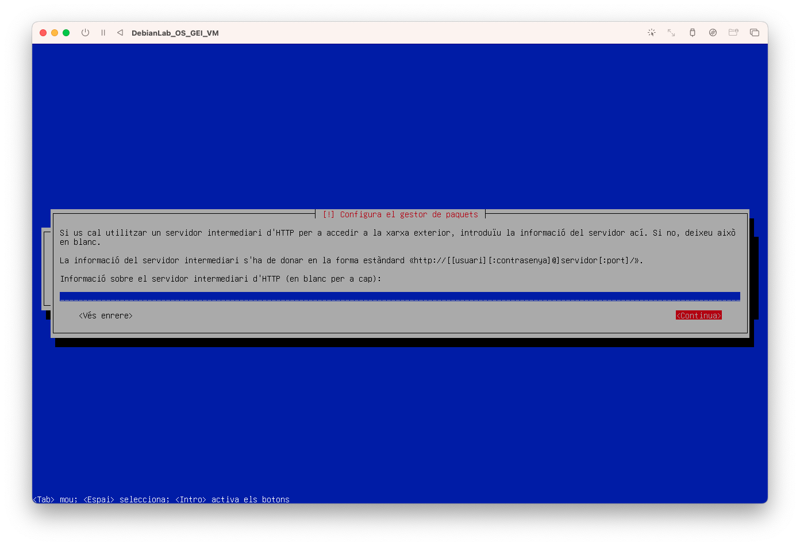

21. Configureu del gestor de paquets i seleccioneu *No*:

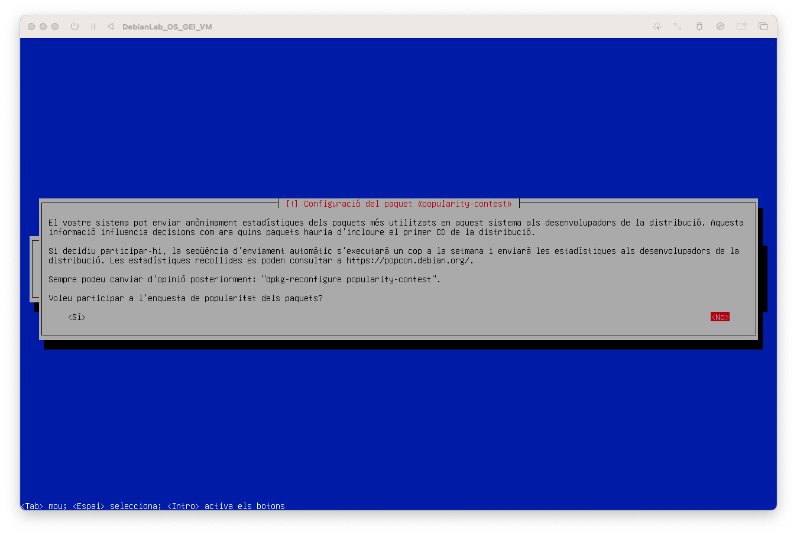

22. Configureu el programari: En aquest curs no necessitem finestres, ho treballarem tot en l'àmbit de la terminal! Deseleccioneu **Desktop i GNOME**. i seleccioneu **SSH**.

{width=50%}

23. Configureu el programari i seleccioneu *Continuar*:

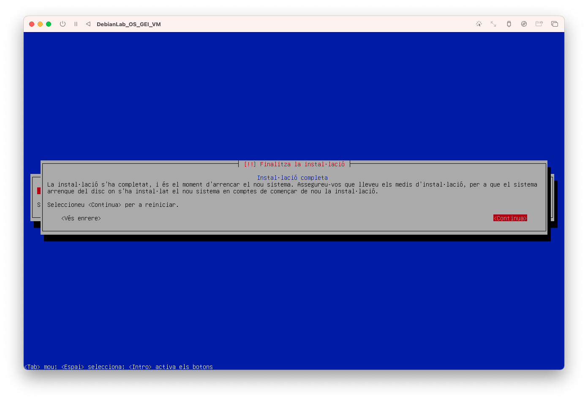


## Provem la instal·lació

1. Desvinculeu la imatge iso.

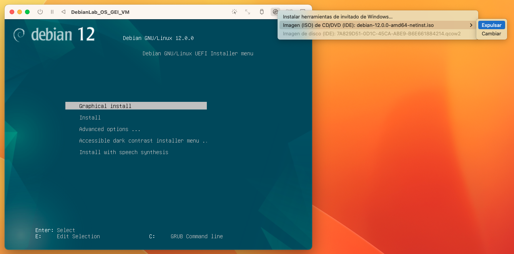

2. Reinicieu la màquina virtual.
3. Arranqueu la màquina i espereu que es carregui el sistema operatiu.
4. Inicieu sessió amb el compte normal que heu generat.
    * **login:** jordi
    * **Pasword:** 1234
5. Escriviu ```whoami``` i us apareixerà el nom del vostre compte.
