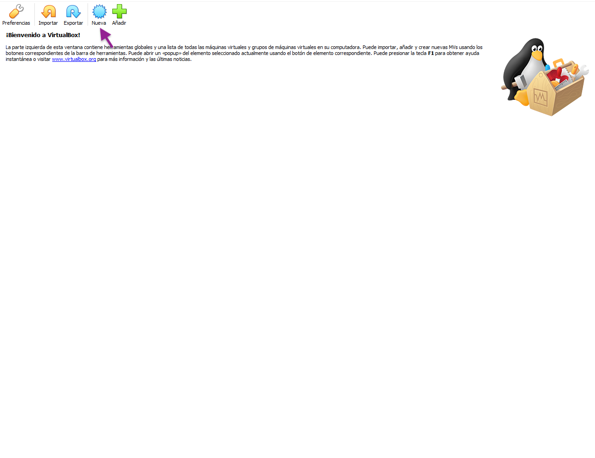
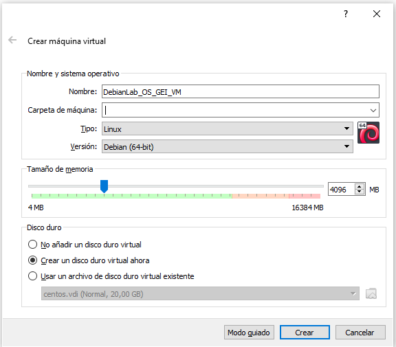
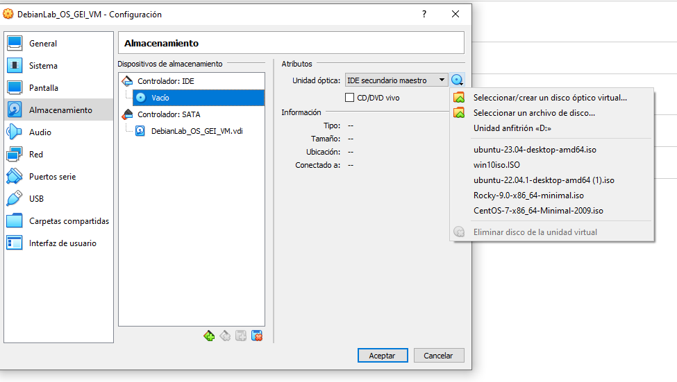
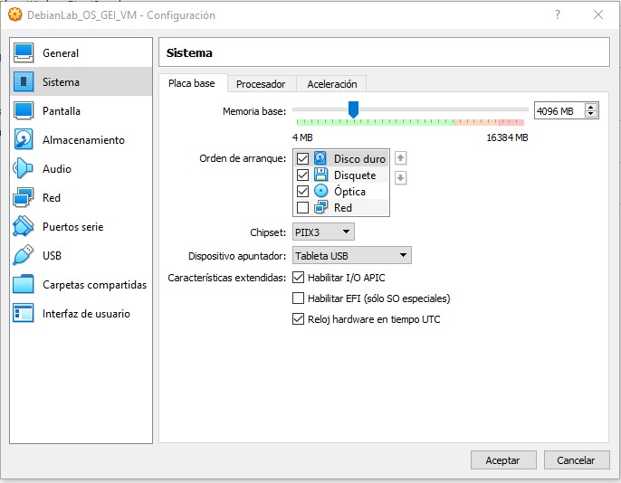

# Instal·lació i Configuració VirtualBox

1. Obrim Virtual Box i fem clic a **New**:

2. Anomenem la màquina virtual **DebianLab_OS_GEI_VM** i seleccionem **Linux** com a sistema operatiu i **Debian (64-bit)** com a versió. Seleccioneu la RAM que voleu assignar a la màquina virtual (recomanem **4096 MB**). Finalment, *Crear un disc virtual ahora* i feu clic a **Crea**:

3. Seleccioneu una ubicació per guardar el disc i també les opcions **VDI (VirtualBox Disk Image)** , **20 GB**, *Reservado dinámicamente* i feu clic a **Crear**:

Un cop fet això, ja tenim la màquina virtual preparada.

Ara necessitem configurar la màquina virtual perquè pugui arrancar amb la imatge ISO de Debian que ens hem descarregat. Seleccioneu la màquina virtual i feu clic a **Configuración**. Després, fes clic a **Almacenamiento** i selecciona **Unidad óptica** a l'esquerra. A la dreta, fes clic a la icona del disc al costat de l'opció *Controlador: IDE Secundario maestro*. A la finestra emergent, selecciona *Selecciona un disc òptic virtual* i selecciona la **imatge ISO de Debian que t'has descarregat**.

Ara configurarem la xarxa. Ves a **Red**, selecciona **Adaptador 1**, assegurat de tenir **NAT** i fes clic *avanzadas*. 

Ara clicarem *Reenvío de puertos* i afegirem una nova regla. Aquesta configuració permetrà que la màquina virtual sigui accessible des de la màquina host a través de SSH. Aquesta configuració permetrà que la màquina virtual sigui accessible des de la màquina host a través de SSH. Afegiu la regla amb els parametres que es mostren a la imatge i cliqueu **Aceptar**.

Finalment, feu clic a **Sistema**, seleccioneu **Placa base** i modifiqueu l'ordre d'arrencada perquè el primer dispositiu sigui el *Disco duro*. D'aquesta manera no us caldrà extreure la imatge *iso* un cop instal·lat el sistema operatiu.

