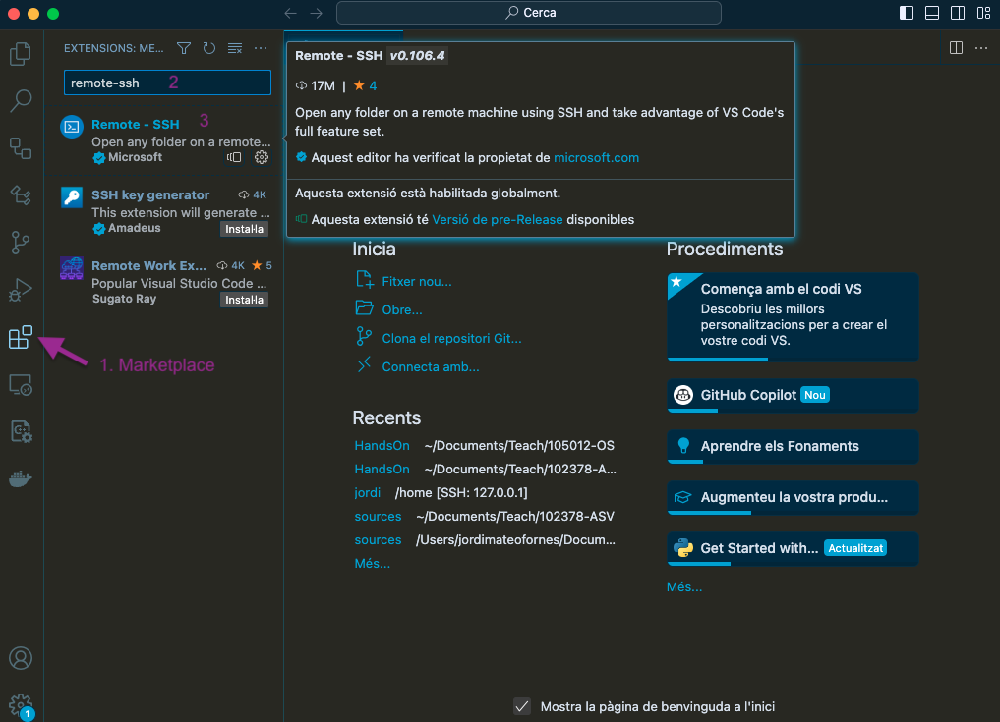
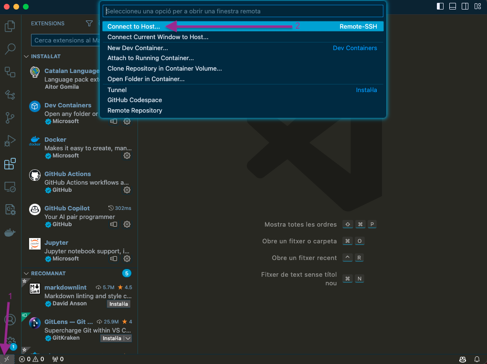
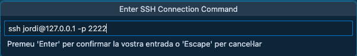
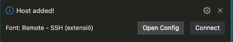
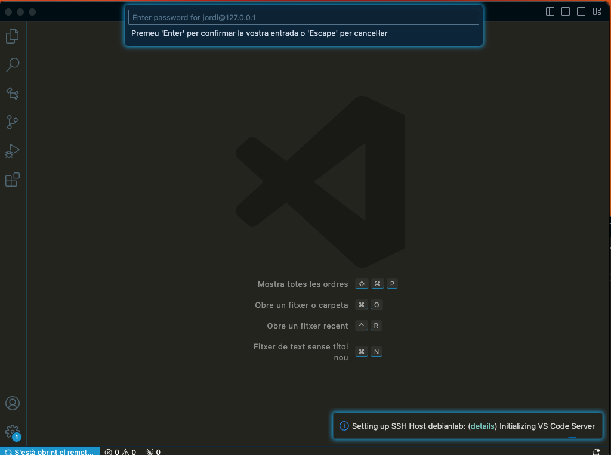
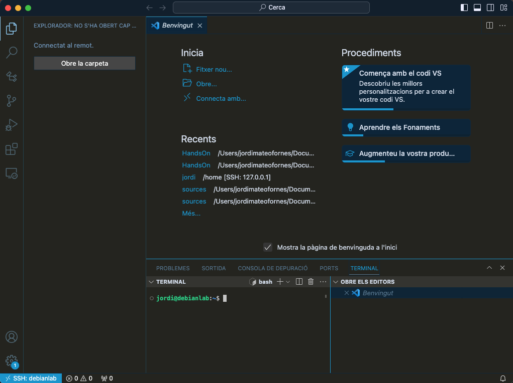

# Configurant el meu entorn de desenvolupament amb VSCode

En aquesta secció, instal·larem i configurarem el Visual Studio Code (VSCode) perquè ens ajudi en el desenvolupament del curs connectant-lo a la màquina virtual **debianlab**.


Per instal·lar el Visual Studio podeu descarregar el programari de [https://code.visualstudio.com/download](https://code.visualstudio.com/download) i seguir els passos d'instal·lació.


Un cop hagueu instal·lat el vostre entorn de desenvolupament (IDE), podeu afegir les següents extensions utilitzant el marketplace de VSCode: **remote-ssh**. Primer, feu clic a **Marketplace (1)**, després cerqueu *remote-ssh* i, finalment, feu clic a **(3)** per instal·lar la extensió. Consulteu la imatge:



Un cop hagueu instal·lat la extensió, ja podeu connectar-vos a la màquina virtual **debianlab**. Per fer-ho, feu clic a la icona de la part inferior esquerra **(1)** i seleccioneu l'opció **Remote-SSH: Connect to Host... (2)**. Consulteu la imatge:



Ara apareixerà una finestra on podreu escriure la connexió SSH. També veureu l'opció **Add a New SSH Host**. Feu clic en aquesta opció i introduïu la comanda SSH per connectar-vos a la màquina virtual **debianlab**. Consulteu la imatge:



Seleccioneu la primera opció del menú desplegable i comproveu que l'amfitrió s'ha afegit correctament.



Ara feu clic a **Open Config** i editeu el fitxer de configuració perquè us connecti a la màquina virtual **debianlab**. Modifiqueu el fitxer de configuració com es mostra a continuació, mantenint el nom d'usuari que correspongui al vostre cas:

```sh
Host debianlab
  HostName 127.0.0.1
  Port 2222
  User jordi
```
Un cop hagueu modificat el fitxer de configuració, podeu fer clic a la icona de la part inferior esquerra i seleccionar l'opció **Remote-SSH: Connect to Host...**. Seleccioneu **debianlab** i introduïu la vostra contrasenya. Consulteu la imatge:



La primera vegada pot trigar uns minuts i demanar la contrasenya un parell de cops. Un cop connectat, ja podeu desenvolupar el curs des de VSCode. Assegureu-vos que a la part inferior hi apareix **SSH:debianlab**. Consulteu la imatge:

