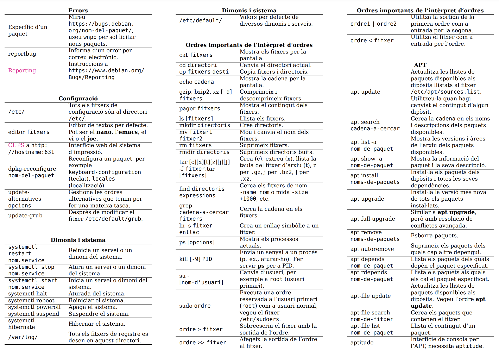

Usuaris a Debian
--------------

Els IDs d'usuari (**uid**) i els ID de grup (**gid**) són valors numèrics que s'utilitzen per identificar els usuaris del sistema i atorgar-hi els permisos adequats.

La comanda ```id X``` ens permet obtenir informació sobre un usuari concret **X**.

```bash
jordi@debianlab:~$ id jordi
uid=1000(jordi) gid=1000(jordi) grups=1000(jordi),24(cdrom),25(floppy),
29(audio),30(dip),44(video),46(plugdev),100(users),106(netdev)
```

Per exemple, si executem `id jordi`, obtenim la següent informació: *uid=1000(jordi) gid=1000(jordi) grups=1000(jordi),24(cdrom),25(floppy), 29(audio),30(dip),44(video),46(plugdev),100(users),106(netdev)*.

En aquest cas, podem veure que l'usuari *jordi* té un **uid** de *1000* i pertany als següents grups:

* cdrom (gid 24): Aquest grup permet l'accés de lectura i escriptura als dispositius de CD/DVD. Els membres d'aquest grup tenen permisos per interactuar amb aquests tipus de dispositius.
* floppy (gid 25): El grup floppy ofereix accés als dispositius de disquet. Els membres d'aquest grup poden llegir i escriure en aquests dispositius.
* audio (gid 29): Aquest grup permet als seus membres utilitzar els dispositius d'àudio. Això inclou la reproducció de so i l'enregistrament d'àudio.
* dip (gid 30): El grup dip proporciona accés als paràmetres de disc i xarxa. Això permet als membres configurar i ajustar la configuració de la xarxa i altres paràmetres relacionats amb el disc.
* video (gid 44): Aquest grup dóna als seus membres accés als dispositius de vídeo i als controladors relacionats. És útil per als usuaris que treballen amb aplicacions que requereixen manipulació de vídeo.
* plugdev (gid 46): El grup plugdev permet als seus membres gestionar dispositius connectats o desconnectats al sistema. Això inclou dispositius USB i altres dispositius connectables.
* users (gid 100): Aquest grup és el grup principal dels usuaris normals del sistema. Proporciona un conjunt bàsic de permisos per a tasques comunes.
* netdev (gid 106): El grup netdev ofereix accés als dispositius de xarxa. Això inclou la configuració i el control de les interfícies de xarxa.

Cada grup té un propòsit específic i atorga certes capacitats i privilegis als seus membres. És important entendre els grups als quals pertany un usuari per tal de comprendre els seus permisos i accions autoritzades al sistema Debian.


Tipus d'usuaris 
-----------------

* Usuari **root**: Aquest usuari té tots els privilegis del sistema operatiu. Pot realitzar qualsevol tipus d'operació sense restriccions; crear i eliminar usuaris, fitxers, directoris, processos i fins i tot eliminar el mateix sistema operatiu.

* Usuari **normal**: La resta d'usuaris. Aquests usuaris tenen uns permisos i rols concedits per l'usuari *root* i únicament poden gestionar els recursos que tenen assignats.

És important utilitzar l'usuari **root** amb precaució i només quan sigui absolutament necessari. En la majoria dels casos, és recomanable utilitzar els usuaris normals per a tasques diàries i reservar l'ús de l'usuari **root** només per a tasques d'administració del sistema.

La seguretat i la gestió adequada dels usuaris són factors clau per a un sistema ben configurat i protegit.

Canvi de sessió d'usuari
------------------------

```sh
jordi@debianlab:~$ whoami
jordi@debianlab:~$ cat /etc/master.passwd 
Permission denied
jordi@debianlab:~$ su
jordi@debianlab:~$ whoami
jordi@debianlab:~$ cat /etc/passwd
jordi@debianlab:~$ su jordi
jordi@debianlab:~$ whoami
jordi@debianlab:~$ exit
jordi@debianlab:~$ whoami
jordi@debianlab:~$ exit
jordi@debianlab:~$ exit
```

Un cop iniciada la sessió amb un usuari concret, com ara *jordi*, a vegades pot ser necessari canviar a un altre usuari per a realitzar tasques específiques o per accedir a recursos restringits. A Debian, podem canviar de sessió d'usuari utilitzant la comanda ```su```.

Utilitzant `su [usuari]`: Podem utilitzar l'ordre su seguida del nom de l'usuari al qual volem canviar per iniciar una nova sessió amb aquest usuari. La comanda demanarà la contrasenya d'aquest usuari per a la verificació. Un cop s'hagi proporcionat la contrasenya correcta, es canviarà la sessió d'usuari i l'indicador del símbol del sistema **($ o #)** canviarà per reflectir l'usuari actual.

L'opció *-*: Si utilitzem `su - [usuari]`, aquesta opció carregarà totes les configuracions d'entorn del nou usuari, incloent variables d'entorn, directori personal i altres configuracions específiques. Això assegurarà que la nova sessió d'usuari tingui les mateixes configuracions que si s'iniciés una sessió nova.

Per exemple, podem canviar a l'usuari *root* utilitzant la comanda `su` sense especificar cap usuari addicional. Això ens demanarà la contrasenya de l'usuari *root* i, un cop verificada, canviarem a la sessió de l'usuari *root*. Podem tornar a canviar a l'usuari original utilitzant la comanda exit.

És important tenir en compte que l'ús de la comanda su amb privilegis d'administrador, com l'usuari *root*, pot tenir repercussions importants en el sistema. És recomanable utilitzar-la amb precaució i només quan sigui necessari per a tasques d'administració del sistema.

Però, a més de la comanda `su`, hi ha una altra opció que pot ser útil per a la pujada de privilegis: el paquet `sudo`. Amb sudo, un usuari pot obtenir temporàriament privilegis d'administració per a realitzar tasques específiques sense haver de canviar completament de sessió.

Per utilitzar sudo, primer cal instal·lar el paquet mitjançant la comanda `apt install sudo`. Un cop instal·lat, els usuaris que estiguin en el *grup sudo* podran utilitzar la comanda `sudo` per a executar comandes amb privilegis d'administració. La comanda sudo demanarà la contrasenya de l'usuari actual i, si es verifica correctament, permetrà a l'usuari executar la comanda desitjada amb privilegis temporals.


Què són les variables d'entorn?
-------------------------------

Les variables d'entorn són una part important del sistema operatiu que permet als processos interactuar amb el seu entorn. Una variable d'entorn és bàsicament una etiqueta que conté un valor. Aquests valors poden ser utilitzats pels processos per accedir a informació específica o configurar el seu comportament.

Les variables d'entorn són àmplies i poden contenir tot tipus d'informació, com ara la ruta d'accés als executables (*PATH*), la llengua preferida (*LANG*), el directori personal de l'usuari (*HOME*), entre altres. Aquestes variables poden ser útils per als processos per a personalitzar el seu comportament i accedir a recursos específics en funció del seu entorn.

Per exemple, podem utilitzar la comanda `printenv` per veure l'entorn d'una sessió. Quan s'inicia una sessió amb un usuari, les variables d'entorn associades a aquest usuari estan disponibles per a tots els processos en aquesta sessió. Si canviem de sessió d'usuari utilitzant su, les variables d'entorn també canviaran per reflectir l'usuari actual.

```sh
jordi@debianlab:~$ whoami
jordi@debianlab:~$ printenv
jordi@debianlab:~$ su 
jordi@debianlab:~$ whoami
jordi@debianlab:~$ printenv
jordi@debianlab:~$ exit
jordi@debianlab:~$ su -
jordi@debianlab:~$ whoami
jordi@debianlab:~$ printenv
```

Com puc gestionar les variables d'entorn?
----------------------------------------

### Comuns
* **PATH**: Informació sobre les rutes per cercar ordres/comandes externes. 
* **HOME**: Directori inicial de l'usuari actual. 
* **USER**: Usuari actual. 
* **PWD**: Directori actual. 
* **MAIL**: Fitxer on s'emmagatzema el correu.

### Operacions
* ```set```: inicialitzar en la shell actual.
* ```export```:  idem ```set``` \blueArrow i que sigui heretada.
* ```unset```: permet eliminar una variable d'entorn.

```sh
jordi@debianlab:~$ echo $HOME
jordi@debianlab:~$ unset HOME
jordi@debianlab:~$ cd $HOME
jordi@debianlab:~$ export HOME=/home/jordi
jordi@debianlab:~$ cd $HOME
jordi@debianlab:~$ pwd
```

**PATH**: Aquesta variable conté una llista de rutes on el sistema buscarà ordres o comandes externes quan s'intenti executar un programa. Per exemple, si volem executar un programa com `ls`, el sistema cercarà en les rutes especificades a la variable *PATH* per trobar l'executable ls. Si l'executable es troba en una d'aquestes rutes, el programa es podrà executar sense problemes.

Podem comprobar amb `whereis ls` que la ruta on es troba la utilitat `ls`, esta inclosa al *PATH*.

```sh
jordi@debianlab:~$ echo $PATH
/usr/local/bin:/usr/bin:/bin:/usr/local/games:/usr/games
jordi@debianlab:~$ whereis ls
ls: /usr/bin/ls /usr/share/man/man1/ls.1.gz
```

Per modificar temporalment el *PATH*, podem assignar-li un nou valor. Per exemple, podem eliminar el contingut de la variable *PATH* amb **PATH=**. En aquest cas, si intentem executar una comanda com ls, el sistema no la trobarà ja que no està especificada en cap de les rutes del *PATH*.

```sh
jordi@debianlab:~$ PATH=
jordi@debianlab:~$ ls
-bash: ls: El fitxer o directori no existeix
jordi@debianlab:~$ /usr/bin/ls
a.txt
```

Per tornar a l'estat inicial:
```sh
jordi@debianlab:~$ PATH="/usr/local/bin:/usr/bin:/bin:/usr/local/games:/usr/games"
```

**HOME**: Aquesta variable emmagatzema la ruta del directori inicial de l'usuari actual. És útil per a referir-se al directori personal d'un usuari en scripts o comandes. Podem utilitzar echo $HOME per visualitzar la ruta del directori inicial de l'usuari actual. És equivalent a **~**.


Què són les shells?
-------------------

Fins ara hem estat enviant ordres al sistema operatiu de forma directa (`whoami`, `printenv`, `su`...). 

La **Shell** ens permet executar ordres utilitzant el nucli del sistema operatiu i ocultant-lo de l'usuari que executa l'ordre. 

| Shell             | Descripció                                                                                                         |
|-------------------|-------------------------------------------------------------------------------------------------------------------|
| Bourne shell      | És la original d'Unix i sol ser la predeterminada en moltes distribucions Linux.                                 |
| C shell           | Sintaxi similar a C amb funcionalitat avançada com: finalització de comandes amb Tab, històric,...              |
| Korn Shell        | Combina les dues anteriors.                                                                                        |
| Bash              | Compatible amb la Bourne shell però amb extensions i funcions avançades.                                           |
| Z shell           | Similar a la Bash però amb més opcions de personalització i una experiència d'ús millorada.                       |


A través de la història de Linux i Unix, molts programadors han desenvolupat shells segons les seves preferències personals.

## Zsh

La shell **Zsh** és una altra opció popular, potent, versàtil i altament configurable, amb moltes característiques avançades i funcionalitats addicionals. **Zsh** ofereix una sintaxi similar a la *Bash*, però amb més opcions de personalització i una experiència d'ús millorada.

Per configurar la shell Zsh amb el framework Oh My Zsh en Debian, segueix els passos següents:

1. Instal·la **Zsh**: Executa la següent comanda com a **usuari (root)** en el terminal per instal·lar **Zsh**:

```sh
root@debianlab:~# apt install zsh -y
```

2. Configura **Zsh** com a shell predeterminada del usuari (jordi): 
```sh
jordi@debianlab:~$ chsh -s $(which zsh)
Contrasenya:
```

3. Reinicia la sessió o tanca i torna a obrir el terminal per aplicar els canvis.

```sh
jordi@debianlab:~$ exit
ssh jordi@127.0.0.1 -p 2222
This is the Z Shell configuration function for new users,
zsh-newuser-install.
You are seeing this message because you have no zsh startup files
(the files .zshenv, .zprofile, .zshrc, .zlogin in the directory
~).  This function can help you with a few settings that should
make your use of the shell easier.

You can:
(q)  Quit and do nothing.  The function will be run again next time.
(0)  Exit, creating the file ~/.zshrc containing just a comment.
     That will prevent this function being run again.
(1)  Continue to the main menu.
(2)  Populate your ~/.zshrc with the configuration recommended
     by the system administrator and exit (you will need to edit
     the file by hand, if so desired).

--> Seleccionar (2)
debianlab# echo $SHELL
/usr/bin/zsh
```

Comandes (Cat \& Echo)
----------------------

### Cat
La comanda ```cat``` llegeix les dades de l'arxiu i mostra el seu contingut com a sortida (**stdout**). Permet crear, veure i concatenar fitxers.

### Echo
La comanda `echo` s'utilitza per mostrar text com a sortida (**stdout**). És similar a la funció `printf` en C i mostra el seu contingut com a sortida.

Podeu utilitar la comanda ```cat``` per mostrar el contingut del fitxer */etc/shells*  que us mostrarà totes les *shells* disponible al vostre sistema i la comanda ```echo``` per mostrar el contingut ([**$**]{.alert}) de la variable d'entorn **SHELL** que us indicarà quina teniu activa en la vostra sessió de treball actual. 

```sh
jordi@debianlab:~$ cat /etc/shells
jordi@debianlab:~$ echo $SHELL
```


Sintaxi de les comandes
-----------------------

``` $ comanda [opcions] [arguments] ```

* **comanda**: nom de la comanda.
* **opcions**: flags i opcions.
* **arguments**: objectes que la comanda necessita (e.g. *fitxers*).
* En una línia podem escriure múltiples comandes separades per **;**.
* Una comanda la podem continuar a la línia següent amb **[\\]{.alert}**.

```sh
jordi@debianlab:~$ cat /etc/shells
jordi@debianlab:~$ cat -e /etc/shells
jordi@debianlab:~$ whoami; cat /etc/shells
```


Què és el Manual?
-------------

El manual ```man``` ens dona informació sobre la sintaxi de les comandes, el seu funcionament, opcions, arguments i exemples d'ús.

- Pots desplaçar-te pel manual utilitzant les fletxes de navegació (amunt i avall) o prement la tecla Enter.
- Per sortir del manual, pots simplement premer la tecla 'q'.
- Si vols cercar una paraula clau dins del manual, pots utilitzar la tecla '\\' seguida del text que vols cercar. Pots desplaçar-te pels resultats de cerca prement *Enter*.

A través de la comanda `man cat`, pots veure com el manual proporciona una explicació detallada de la comanda `cat`, la seva sintaxi, opcions, arguments i exemples d'ús

Com esta organitzat el Manual?
-------------------------------

El manual està organitzat en seccions temàtiques, cadascuna centrada en un tema específic:

  - **Secció 1**: Comandes executables o programes de l'usuari (e.g., `cat`, `ls`).
  - **Secció 2**: Crides de sistema (system calls) i funcions del nucli del sistema operatiu.
  - **Secció 3**: Funcions de biblioteca de programació.
  - **Secció 4**: Arxius especials del sistema i dispositius (e.g., `/dev/null`, `/dev/sda`).
  - **Secció 5**: Arxius de configuració del sistema (e.g., `/etc/passwd`, `/etc/fstab`).
  - **Secció 6**: Jocs (e.g., `nethack`, `snake`).
  - **Secció 7**: Diversos documents, com ara convencions de fitxers i protocols de xarxa.
  - **Secció 8**: Ordres per a administradors de sistema (e.g., `mount`, `ifconfig`).

Per què `man 1 printf` es diferent a `man 3 printf`?
-----------------------

\blueArrow La raó per la qual hi ha dues pàgines de manual és que printf és una comanda utilitzada a la línia de comandes i també és una funció de la biblioteca C que s'utilitza en la programació en C. Les dues pàgines de manual proporcionen informació específica sobre l'ús i la sintaxi de printf en cada context.

* `man 1 printf`: Tracta de les comandes de l'usuari en el sistema. Aquí trobaràs informació sobre l'ús de la comanda *printf* en el context de la línia de comandes.

* `man 3 printf`: Tracta de les funcions de la biblioteca *C*. Aquí trobaràs informació específica sobre la funció *printf* en C, incloent la seva sintaxi, opcions, arguments i exemples d'ús.


Mitjançant l'exemple de `printf`, pots veure com el manual proporciona una explicació detallada tant de la comanda `printf` com de la funció `printf` en C, incloent la seva sintaxi, opcions, arguments i exemples d'ús. És important consultar el manual quan necessitis ajuda o informació addicional sobre una comanda o funció en particular. 

Dates a Debian 
--------------

- `date`: Mostra la data i hora actual.
- `cal`: Mostra el calendari per al mes o any especificat.
- `hwclock`: Gestiona l'hora de l'RTC (Real-Time Clock) del sistema.

```sh
jordi@debianlab:~$ date
jordi@debianlab:~$ cal
jordi@debianlab:~$ hwclock --show
```

Temps a Debian
-----------------------

- `uptime`: Mostra el temps transcorregut des de l'últim reinici.
- `time`: Mesura el temps d'execució d'una comanda i en dóna informació detallada.

```sh
jordi@debianlab:~$ uptime
jordi@debianlab:~$ time ls
```

El tipus de dades `time_t` i el problema del 2038
--------------------------------------------------

En molts sistemes, el tipus de dades `time_t` s'utilitza per representar valors de temps. 

Aquest tipus de dades emmagatzema el temps com un nombre enter, que sol ser un nombre de segons des de l'1 de gener de 1970. **time_t** emmagatzema el temps com un nombre enter signat de 32 bits. 

Per tant, únicament pot representar enters entre [−(231) i 231 −1]{.alert}, \blueArrow l'última hora que es pot codificar correctament és **231 − 1** segons després de l'època UNIX *(03:14:07 UTC el 19 de gener de 2038)*. Intentar augmentar al segon següent *(03:14:08)* **farà que l'enter es desbord**i, establint el seu valor a **-(231)**, que els sistemes interpretaran com a [231 segons abans de l'època]{.alert} *(20:45:52 UTC el 13 de desembre de 1901)*. [https://en.wikipedia.org/wiki/Year_2038_problem](https://en.wikipedia.org/wiki/Year_2038_problem)


Pateix debian del problema del 2038?
-------------------------------------

Els desenvolupadors de Debian han tingut en compte aquest problema i han pres les mesures adequades per a evitar-ne les conseqüències negatives. Això proporciona als usuaris de Debian la confiança de poder utilitzar el sistema de forma fiable i precisa en la gestió de temps, sense preocupar-se pel problema del 2038.

En el següent exemple es pot observar com debian es capaç de representar una data superior al 2038. Això és deu a que **time_t** utilitza un nombre amb 64 bits.
```sh
jordi@debianlab:~$ date -d "1 Jan 2040"
Thu Jan  1 00:00:00 UTC 2040
```

Qué és el sistema de fitxers?
---------------------------------

El sistema de fitxers és l'estructura que utilitza un SO per organitzar i emmagatzemar informació en el disc. Aquest sistema defineix com es guarden i s'accedeixen als fitxers i directoris en el sistema operatiu.

- **Fitxers**: Un fitxer és una col·lecció d'informació que es guarda en el disc. Pot contenir text, dades binàries, codi executable, entre altres tipus d'informació.
- **Directoris**: Els directoris són utilitzats per organitzar els fitxers en grups lògics. Cada fitxer es troba en un directori específic, i els directoris poden contenir altres directoris o fitxers.
- **Fitxers especials**: A més dels fitxers i directoris regulars, hi ha altres tipus de fitxers especials que representen dispositius connectats al sistema. Poden ser de caràcters o de blocs, depenent del tipus de dispositiu.


Sistema de fitxers i particions
-------------------------------

Cada disc o partició en un sistema té el seu propi sistema de fitxers. Pots utilitzar la comanda `df -h` per veure una llista de les particions i els seus sistemes de fitxers associats, així com la informació d'ús d'espai en disc.

```bash
jordi@debianlab:~$ df -h
S. fitxers      Mida En ús Lliure  %Ús Muntat a
udev            1,9G     0   1,9G   0% /dev
tmpfs           392M  616K   391M   1% /run
/dev/sda2        19G  1,7G    16G  10% /
tmpfs           2,0G     0   2,0G   0% /dev/shm
tmpfs           5,0M     0   5,0M   0% /run/lock
/dev/sda1       511M  5,9M   506M   2% /boot/efi
tmpfs           392M     0   392M   0% /run/user/1000
```

En aquest exemple, tenim diverses particions amb els seus sistemes de fitxers associats:
* /dev/sda2 té un sistema de fitxers associat i està muntat com a directori arrel (/). Té una mida total de 19G, amb 1,7G utilitzats i 16G lliures. El % d'ús és del 10%.
* /dev/sda1 té un sistema de fitxers associat i està muntat a /boot/efi. Té una mida total de 511M, amb 5,9M utilitzats i 506M lliures. El % d'ús és del 2%.
Altres particions, com *udev*, *tmpfs* i */run*, tenen els seus propis sistemes de fitxers associats i són utilitzades per al funcionament del sistema operatiu.
Aquesta informació ens dóna una visió de com està utilitzat l'espai en disc a cada partició i ens permet monitorar l'ús d'espai.


Com esta estructurat el sistema de fitxers **(/)**?
--------------------------------------------------------------------


A través del sistema de fitxers principal, els usuaris poden gestionar i accedir a la informació emmagatzemada en el disc. És important comprendre l'estructura i el funcionament del sistema de fitxers per a una correcta gestió i organització dels fitxers i directoris en el sistema operatiu Debian.


| Directori | Contingut                               |
|-----------|-----------------------------------------|
| bin       | Binaris d'ordres essencials              |
| boot      | Fitxers estàtics del carregador de l'arrencada |
| dev       | Fitxers de dispositius                   |
| etc       | Configuració específica de l'amfitrió del sistema |
| home      | Directoris d'inici d'usuari              |
| lib       | Llibreries compartides essencials i mòduls del nucli |
| media     | Punts de muntatge per a mitjans reemplaçables |
| mnt       | Punt de muntatge per muntar un sistema de fitxers temporalment |
| proc      | Directori virtual per a informació del sistema |
| root      | Directori d'inici per a l'usuari root    |
| run       | Dades variables d'execució               |
| sbin      | Binaris essencials del sistema           |
| sys       | Directori virtual per a informació del sistema |
| tmp       | Fitxers temporals                        |
| usr       | Jerarquia secundària                     |
| var       | Dades variables                          |
| srv       | Dades per a serveis proporcionats pel sistema |
| opt       | Paquets de programari addicional         |
| .         | Directori actual                        |
| ..        | Directori anterior                      |


Què són els inodes?
-------------------

Són una estructura de metadades utilitzada pels sistemes de fitxers per emmagatzemar informació sobre els fitxers i directoris. Cada fitxer o directori en un sistema de fitxers té un inode associat.

](../handson00/figs/inodes.png)

- **Identificador Únic**: Cada inode té un identificador únic que l'identifica de manera única dins del sistema de fitxers.
- **Metadades del Fitxer**: L'estructura d'un inode emmagatzema metadades importants com el tipus de fitxer, els permisos d'accés, el propietari i el grup, el tamany del fitxer i les timestamps de creació, modificació i accés.
- **Apuntadors a Blocs**: Els inodes contenen apuntadors a blocs de dades que emmagatzemen el contingut real del fitxer.
- **Enllaços Durs i Soft**: El nombre d'enllaços durs i enllaços simbòlics que apunten a un inode determina la seva referència i disponibilitat.

Podem utilitzar la comanda `stat` per veure les metadades d'un fitxer o directori. En aquest exemple, podem veure les metadades del directori */home*.

```bash
jordi@debianlab:~$: stat /home/
     Fitxer: /home/
       Mida: 4096      	Blocs: 8          Bloc d’E/S: 4096   directori
Device: 8,2	Inode: 913921      Links: 3
      Accés: (0755/drwxr-xr-x)  UID: (    0/    root)   GID: (    0/    root)
      Accés: 2023-07-11 09:52:31.307443950 +0200
Modificació: 2023-07-07 16:54:09.656731220 +0200
      Canvi: 2023-07-07 16:54:09.656731220 +0200
  Naixement: 2023-07-07 16:34:47.016777227 +0200
```

- Els inodes permeten als sistemes de fitxers gestionar i accedir eficientment a les metadades i contingut dels fitxers.
- Proporcionen una forma eficaç de mantenir un seguiment dels fitxers i directoris en el sistema de fitxers.
- Són essencials per establir les relacions entre fitxers i enllaços durs i simbòlics.


Els inodes són una part fonamental del sistema de fitxers i proporcionen informació essencial per a l'organització i accés als fitxers i directoris en el sistema operatiu.


Què són els enllaços?
--------------------

### Hard 

Un mateix fitxer pot tenir diversos enllaços inclosos al mateix directori o en diferents, de manera que pot tenir diversos noms de fitxer.

### Soft

Són fitxers que contenen un nom de ruta arbitrari d'un altre fitxer. El **nom del camí** pot fer referència a **qualsevol fitxer situat en qualsevol sistema de fitxers**; [fins i tot pot referir-se a un fitxer inexistent]{.alert}.

### Limitacions dels enllaços Hard

Enllaços únicament entre fitxers. Els usuaris no poden crear-los per a directoris. Això permetria transformar l'arbre de directoris en un graf amb cicles. Fent impossible la localització de fitxers.


### Creació (Hard)
```ln f1 f2``` s'utilitza per crear un nou enllaç dur que tingui el nom de ruta f2 per a un fitxer identificat amb el nom de ruta f1.

### Creació (Soft)
```ln -s f1 f2``` crea un nou enllaç **soft** amb **f2** que fa referència a **f1**. \blueArrow El sistema de fitxers extreu la part del directori de **f2** i crea una nova entrada en aquest directori de tipus enllaç simbòlic, amb el nom indicat per **f2**. Aquest nou fitxer conté el nom indicat pel nom de ruta **f1**. Cada referència a **f2** es pot traduir automàticament en una referència a **f1**.


](../handson00/figs/hard-soft.png)


Considerem el següent escenari: tens dos fitxers, `fitxer1.txt` i `fitxer2.txt`, al teu directori actual.

```bash
jordi@debianlab:~$ echo "Contingut del fitxer 1" > fitxer1.txt
jordi@debianlab:~$ echo "Contingut del fitxer 2" > fitxer2.txt
jordi@debianlab:~$ ls -i fitxer1.txt fitxer2.txt
jordi@debianlab:~$ ln fitxer2.txt enllac_hard.txt
jordi@debianlab:~$ ln -s fitxer1.txt enllac_soft.txt
jordi@debianlab:~$ ls -i enllac_hard.txt enllac_soft.txt
```

En aquest exemple es mostra la creación de dos fitxers, la visualización dels seus inodes y la creació d'enllaços enlaces hard i soft a Debian. 


Rutes
------

L'estructura **arbre** d'Unix/Linux requereix que per accedir a un *fitxer* o *directori* necessitem especificar la seva **ruta**.

* Ruta absoluta: Especifiquem tot el camí des del directori **arrel**. 
* Ruta relativa: Especifiquem  tot el camí des del directori **actual**.

Imagineu que estem al directori de l'usuari **/home/jordi** i volem imprimir amb ```cat``` el fitxer *a.txt*. Tenim dues opcions:
* Ruta absoluta: ```cat /home/jordi/a.txt```
* Ruta relativa: ```cat a.txt```

```sh
jordi@debianlab:~$ cd /home/jordi
jordi@debianlab:~$ echo "Hola Jordi" > a.txt
jordi@debianlab:~$ cat /home/jordi/a.txt
jordi@debianlab:~$ cat a.txt
jordi@debianlab:~$ cd ..
jordi@debianlab:~$ cat /home/jordi/a.txt
jordi@debianlab:~$ cat a.txt
```

1. Primer ens situarem al directori */home/jordi*.
2. Crearem un fitxer amb la comanda ```echo```. Redirigim la sortida de la cadena *Hola Jordi* al fitxer **a.txt** amb la redirecció [>]{.alert}.
3. Imprimim el contingut a sortida estàndard (stdout) amb ruta absoluta i relativa.
4. Ens situem al directori anterior.
5. Observem com la ruta absoluta continua funcionant, però no la relativa.


Comandes relacionades amb fitxers i directoris
-----------------------------------------------

* ```pwd```: Obtenir el directori actual.
* ```cd```: Navegar al directori.
* ```mkdir```: Crear un directori.
* ```rmdir```: Eliminar un directori.
* ```touch```: Crear un fitxer.
* ```rm```: Eliminar un fitxer.
* ```ls```: Llista el contingut del directori.


```sh
jordi@debianlab:~$ cd /home/jordi
jordi@debianlab:~$ ls; pwd
jordi@debianlab:~$ mkdir test; ls; ls -la;
jordi@debianlab:~$ touch b.txt; ls
jordi@debianlab:~$ rm b.txt; ls
jordi@debianlab:~$ rmdir test/; ls
```


Sistema de protecció de fitxers
-------------------------------

UNIX/Linux permet controlar **QUI** pot accedir als fitxers i directoris a través dels permisos.

### Nivell
* **Owner**: Usuari que ha creat el fitxer.
* **Group**: Usuaris dels grups.
* **Other**: Qualsevol usuari del sistema.

```sh
$ touch a.txt
$ ls -la a.txt
```

### Permisos
* **Lectura [r]**: Dona accés al contingut del fitxer o a llistar fitxers dins del directori
* **Escriptura [w]**: Permet canviar el contingut del fitxer o crear/suprimir fitxers 
* **Execució [x]**: Permet executar el fitxer/ordre o permet cercar un directori


Sistema de protecció de fitxers
-------------------------------

```bash
jordi@debianlab:~$ touch a.txt
jordi@debianlab:~$ ls -la a.txt
-rw-r--r-- 1 jordi jordi 0 11 de jul.  11:26 a.txt
```

L'usuari *jordi* és owner del fitxer **a.txt** i pot **llegir/escriure** però no **executar**. Els membres del grup *jordi* poden **llegir** el fitxer, però [**no escriure ni executar**]{.alert}. Igual que la resta d'usuaris.


Gestionant els permisos
-------------------------

```chmod [qui] operació permisos fitxer```
* u: owner 
* g: group 
* o: others 
* a: all (u+g+o)
* +: afegir
* -: eliminar
* r: lectura
* w: escriptura
* x: execució


A continuació, es mostren alguns exemples d'ús de la comanda `chmod` per a operacions comuns de gestió de permisos:

```sh
chmod u+x a.txt # Afegir el permís d'execució
chmod o-r a.txt # Eliminar el permís de lectura (others)
chmod g+w a.txt # Afegir el permís d'escriptura al (group)
chmod o+w a.txt # Afegir escriptura a (others)
chmod a-w a.txt # Eliminar tots els permisos d'escriptura
```

- `chmod u+x a.txt`: Aquesta comanda afegirà el permís d'execució (x) a l'usuari propietari (u) del fitxer `a.txt`.
- `chmod o-r a.txt`: Amb aquesta comanda, eliminem el permís de lectura (r) per a altres usuaris (o) del fitxer `a.txt`.
- `chmod g+w a.txt`: Aquí afegim el permís d'escriptura (w) al grup (g) del fitxer `a.txt`.
- `chmod o+w a.txt`: Aquesta comanda afegirà el permís d'escriptura (w) per a altres usuaris (o) del fitxer `a.txt`.
- `chmod a-w a.txt`: Amb aquesta comanda, eliminem tots els permisos d'escriptura (w) per a tots els usuaris (a) del fitxer `a.txt`.

És important entendre les parts clau de la comanda `chmod`:

- `qui`: Especifica a quin grup d'usuaris apliquem el canvi de permisos. Pot ser `u` (propietari), `g` (grup), `o` (altres) o `a` (tots).
- `operació`: Indica si volem afegir (`+`) o eliminar (`-`) els permisos especificats.
- `permisos`: Representa els permisos que volem afegir o eliminar. Pot ser `r` (lectura), `w` (escriptura) i `x` (execució).

Aprofita per personalitzar els permisos dels fitxers i garantir una gestió adequada de l'accés i les accions dels usuaris sobre els fitxers i directoris del teu sistema.


```bash
jordi@debianlab:~$ chmod +x a.txt
jordi@debianlab:~$ ls -la a.txt
-rwxr-xr-x 1 jordi jordi 0 11 de jul.  11:26 a.txt
jordi@debianlab:~$ chmod -x a.txt
jordi@debianlab:~$ ls -la a.txt
-rw-r--r-- 1 jordi jordi 0 11 de jul.  11:26 a.txt
jordi@debianlab:~$ chmod o-r a.txt
jordi@debianlab:~$ ls -la a.txt
-rw-r----- 1 jordi jordi 0 11 de jul.  11:26 a.txt
jordi@debianlab:~$ chmod g+w a.txt
jordi@debianlab:~$ ls -la a.txt
-rw-rw---- 1 jordi jordi 0 11 de jul.  11:26 a.txt
jordi@debianlab:~$ chmod o+w a.txt
jordi@debianlab:~$ ls -la a.txt
-rw-rw--w- 1 jordi jordi 0 11 de jul.  11:26 a.txt
jordi@debianlab:~$ chmod a-w a.txt
jordi@debianlab:~$ ls -la a.txt
-r--r----- 1 jordi jordi 0 11 de jul.  11:26 a.txt
jordi@debianlab:~$ echo "a" >> a.txt
-bash: a.txt: S’ha denegat el permís
jordi@debianlab:~$ cat a.txt
jordi@debianlab:~$ chmod +w a.txt
jordi@debianlab:~$ echo "a" >> a.txt
jordi@debianlab:~$ cat a.txt
a
jordi@debianlab:~$ chmod -r a.txt
jordi@debianlab:~$ cat a.txt
cat: a.txt: S’ha denegat el permís
```

En aquest exemple, realitzem diverses operacions amb els permisos del fitxer creat anteriorment *a.txt*.

1. Amb `ls -la a.txt`, mostrem els permisos originals del fitxer: *-rw-r--r--*.
2. Amb `chmod +x a.txt`, afegim el permís d'execució per a tots els usuaris (owner, grup i altres).
3. Amb `ls -la a.txt`, podem veure que ara el fitxer té permisos d'execució: *-rwxr-xr-x*.
4. Amb `chmod -x a.txt`, eliminem el permís d'execució per a tots els usuaris.
5. Amb `ls -la a.txt`, podem veure que els permisos d'execució han estat eliminats: *-rw-r--r--*.
6. Amb `chmod o-r a.txt`, eliminem el permís de lectura per a altres usuaris.
7. Amb `ls -la a.txt`, podem veure que ara el fitxer té permisos de lectura només per a l'usuari i el grup, i no per a altres: *-rw-r-----*.
8. Amb `chmod g+w a.txt`, afegim el permís d'escriptura per al grup.
9. Amb `ls -la a.txt`, podem veure que ara el fitxer té permisos de lectura i escriptura per a l'usuari i el grup, però no per a altres: *-rw-rw----*.
10. Finalment, amb `chmod o+w a.txt`, afegim el permís d'escriptura per a altres usuaris.
11. Amb `ls -la a.txt`, podem veure que ara el fitxer té permisos de lectura, escriptura i escriptura per a l'usuari, el grup i altres: *-rw-rw--w-*.
12. Amb la comanda `chmod a-w a.txt`, eliminem el permís d'escriptura per a tots els usuaris (owner, grup i altres). 
13. Amb `ls -la a.txt`, podem veure que el permís d'escriptura (w) ha estat eliminat per a tots els usuaris.
14. Quan intentem afegir contingut a *a.txt* amb `echo "a" >> a.txt`, obtenim un error que indica que **s'ha denegat el permís d'escriptura**.
15. Amb la comanda `chmod +w a.txt`, afegim el permís d'escriptura a tots els usuaris. 
16. Ara podem afegir contingut amb `echo "a" >> a.txt` i veure el contingut amb `cat a.txt`.
17. Finalment, amb `chmod -r a.txt`, eliminem tots els permisos de lectura per a tots els usuaris. Quan intentem llegir el contingut de *a.txt* amb `cat a.txt`, obtenim un error que indica que **s'ha denegat el permís de lectura**.

Cheat Sheet
===========

Us podeu descàrregar i consultar la targeta de referència per a Debian 12.0 *Bookworm* en format PDF en el següent enllaç: [https://www.debian.org/doc/manuals/refcard/refcard](https://www.debian.org/doc/manuals/refcard/refcard)




Resum de comandes per a fitxer:

* ```ls -la```: Llista amb format de tots els fitxers (normals i ocults).
* ```cd```: Navegar a un directori. 
* ```pwd```: Mostra el directori actual.
* ```mkdir```: Crear un directori.
* ```rm -rf```: Eliminar de forma recursiva (fitxers i directoris).
* ```cp f1 f2```: Copia el fitxer f1 al fitxer f2.
* ```mv f1 f2```: Moure o reanomenar el fitxer f1 a f2.
* ```more f1```: Mostra el contingut del fitxer f1.
* ```less f1```: Mostra el contingut del fitxer f1.
* ```head f1```: Mostra les primeres 10 línies del fitxer f1.
* ```tail f1```: Mostra les últimes 10 línies del fitxer f1.

Resum de comandes per a consultar informació del sistema:

* ```date```: Mostra la data i el temps actuals.
* ```cal```: Mostra el calendari.
* ```uptime```: Mostra el temps que el servidor porta actiu.
* ```w```: Mostra quins usuaris estan actius online.
* ```whoami```: Mostra el nom de l'usuari actual.
* ```finger user```: Mostra informació de l'usuari.
* ```uname -a```: Mostra informació sobre el kernel.
* ```cat /proc/cpuinfo```: Mostra informació sobre la cpu.
* ```cat /proc/meminfo```: Mostra informació sobre la memòria.
* ```df```: Mostra informació sobre l'utiltizació del disc.
* ```du```: Mostra informació sobre l'espai utilitzat al directori.
* ```whereis app```: Mostra les localitzacions de app.
* ```which app```: Mostra quina app s'executarà per defecte.

Resum de comandes per a la compressió de fitxers:

* ```tar cf f.tar files```: Comprimeix files en un fitxer f.tar.
* ```tar xf file.tar```: Extreu els fitxers de file.tar al directori actual.
* ```tar czf file.tar.gz files```: Comprimeix amb Gzip.
* ```tar xzf file.tar.gz```: Extreu els fitxers comprimits amb Gzip.
* ```tar cjf file.tar.bz2 files```: Comprimeix amb Bzip2.
* ```tar xjf file.tar.bz2```: Extreu els fitxers comprimits amb Bzip2.
* ```gzip file```: Comprimeix el fitxer file i l'anomena file.gz.
* ```gzip -d file.gz```: Descomprimeix el fitxer file.gz.

Resum de comandes per consultar informació de la xarxa:

* ```ping``` host: Ping a una ip i mostra els resultats.
* ```whois``` domain: Aconsegueix informació sobre el domini.
* ```dig``` domain: Obté informació sobre els dns del domini.
* ```wget``` file: Descarrega un fitxer.