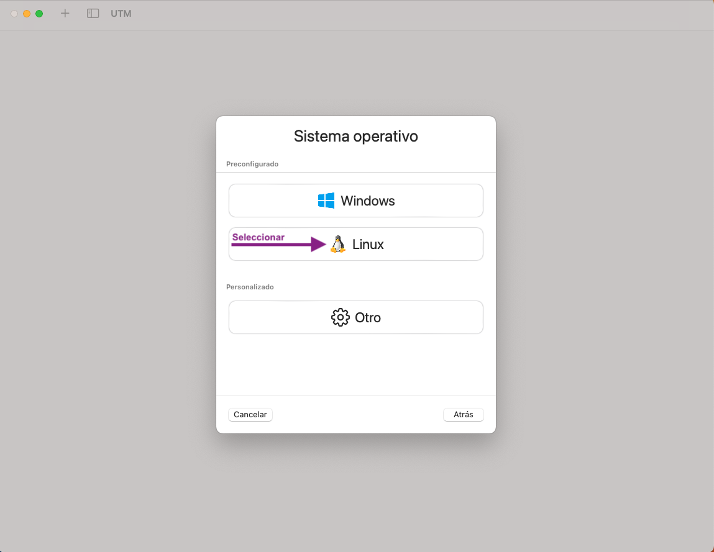
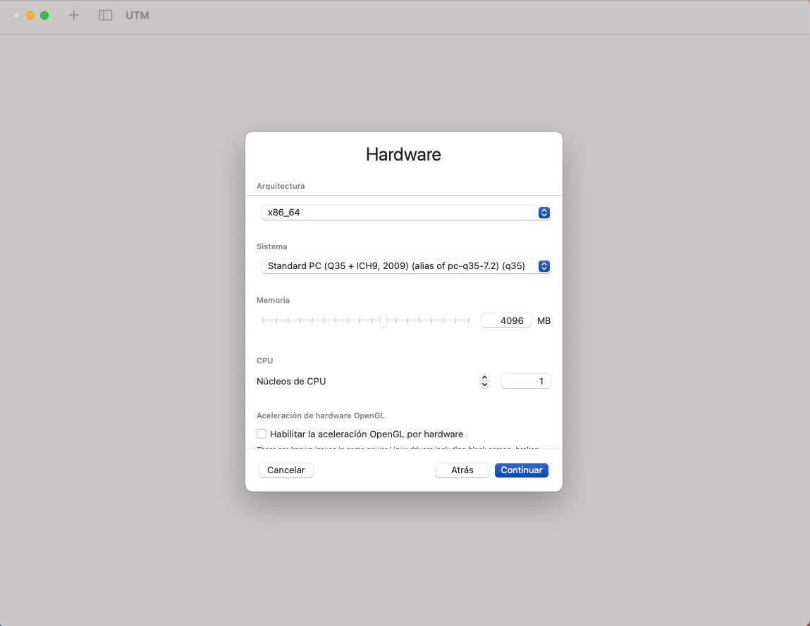
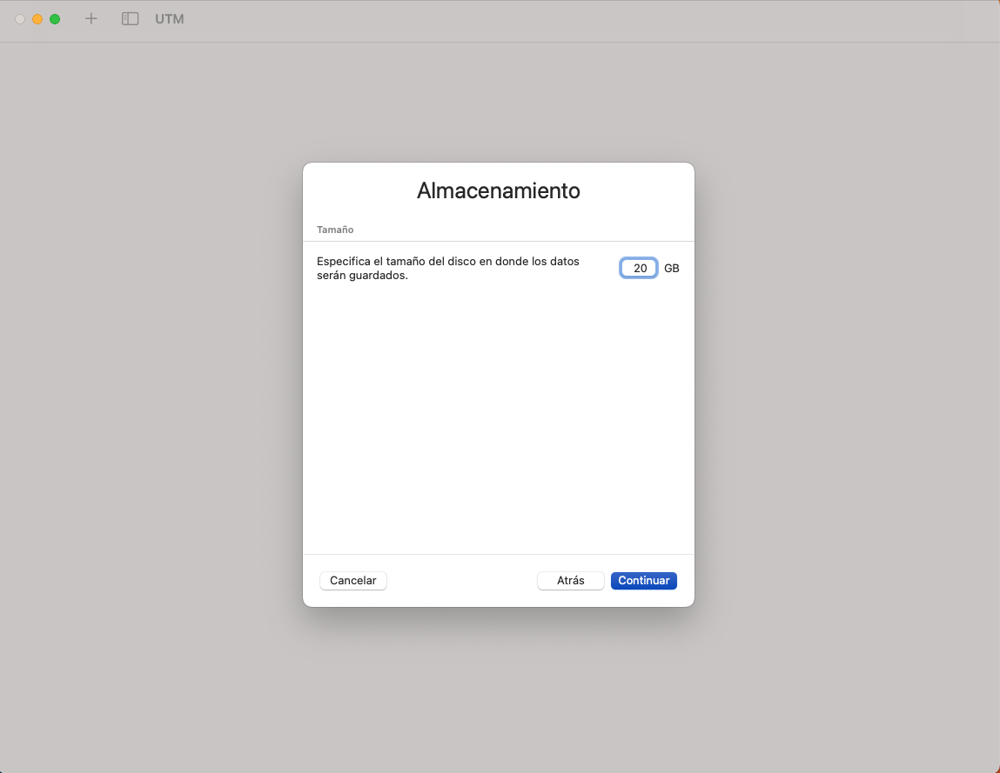
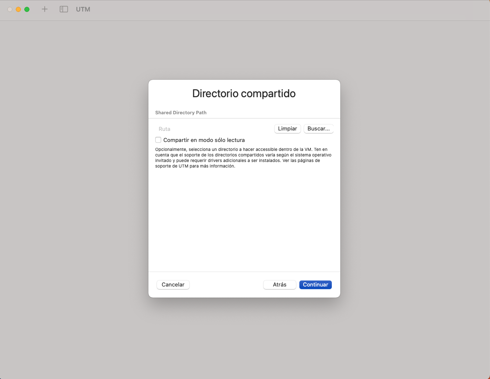
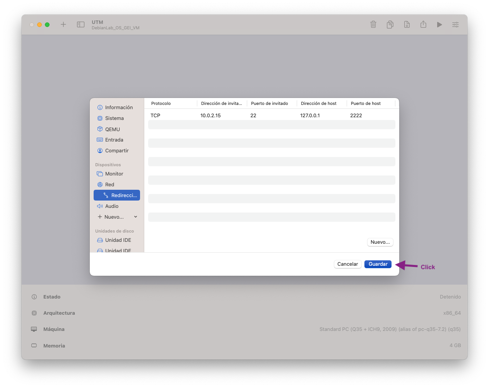

# Instal·lació i Configuració UTM

1. Feu clic a **Crear una nueva VM**:

2. Feu clic a **Emular**:

3. Feu clic a **Linux**

4. Seleccioneu la imatge **iso** que us heu descarregat:

5. Seleccioneu **1 CPU** cores i **4096 MB**:

6. Seleccioneu **20GB**  de disc

7. Feu clic a **Continuar**, no farem anar Shared directories!

8. Nombreu-la **DebianLab_OS_GEI_VM**, feu clic a **Guardar**

9. Aneu a red i seleccioneu VLAN emulat

10. Aneu a redireccionament,  nou i completar

11. Revisa que l'estat final de la configuració de la xarxa coincideixi amb:

